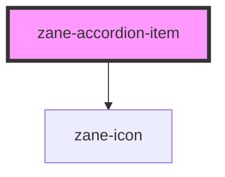

# zane-accordion-item

<!-- Auto Generated Below -->

## Properties

| Property | Attribute | Description | Type | Default |
| --- | --- | --- | --- | --- |
| `disabled` | `disabled` | If true, the user cannot interact with the button. Defaults to `false`. | `boolean` | `false` |
| `heading` | `heading` | The menu item value. | `string` | `undefined` |
| `open` | `open` | Menu item selection state. | `boolean` | `false` |

## Events

| Event | Description | Type |
| --- | --- | --- |
| `zane-accordion-item--click` | Emitted when the menu item is clicked. | `CustomEvent<any>` |

## Shadow Parts

| Part      | Description |
| --------- | ----------- |
| `"title"` |             |

## CSS Custom Properties

| Name | Description |
| --- | --- |
| `--zane-accordion-item-heading-background - Background color of the accordion item header` |  |
| `--zane-accordion-item-heading-background-hover - Background color of the accordion item header on hover` |  |
| `--zane-accordion-item-title-align - Alignment of the accordion title` |  |

## Dependencies

### Depends on

- [zane-icon](../../icon)

### Graph

---

_Built with [StencilJS](https://stenciljs.com/)_
