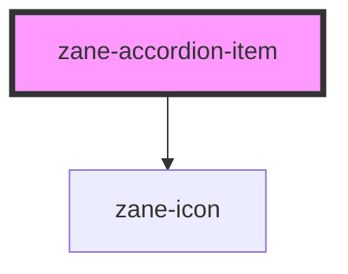

# zane-accordion-item

<!-- Auto Generated Below -->

## Overview

可折叠面板项(Accordion Item)组件

作为zane-accordion的子组件使用，实现单个可折叠面板项的功能

## Properties

| Property | Attribute | Description | Type | Default |
| --- | --- | --- | --- | --- |
| `disabled` | `disabled` | 禁用状态控制 - true: 禁用该折叠项，不可交互 - false: 正常状态(默认) | `boolean` | `false` |
| `heading` | `heading` | 面板标题文本 当heading插槽无内容时显示此文本 | `string` | `undefined` |
| `open` | `open` | 面板展开状态 - true: 面板已展开 - false: 面板已折叠(默认) | `boolean` | `false` |

## Events

| Event | Description | Type |
| --- | --- | --- |
| `zane-accordion-item--click` | 面板点击事件 当面板被点击时触发，携带当前元素引用和状态 | `CustomEvent<any>` |

## Slots

| Slot                                     | Description |
| ---------------------------------------- | ----------- |
| `"default 内容插槽，放置折叠面板的内容"` |             |
| `"heading 标题插槽，可自定义标题内容"`   |             |

## Shadow Parts

| Part      | Description |
| --------- | ----------- |
| `"title"` |             |

## CSS Custom Properties

| Name | Description |
| --- | --- |
| `--zane-accordion-item-heading-background - Background color of the accordion item header` |  |
| `--zane-accordion-item-heading-background-hover - Background color of the accordion item header on hover` |  |
| `--zane-accordion-item-title-align - Alignment of the accordion title` |  |

## Dependencies

### Depends on

- [zane-icon](../../icon)

### Graph

---

_Built with [StencilJS](https://stenciljs.com/)_
