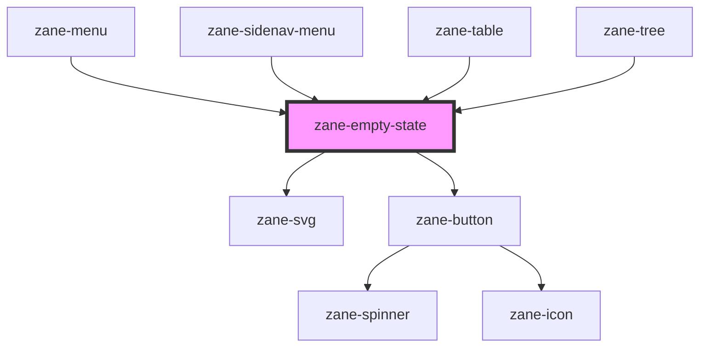

# zane-empty-state

<!-- Auto Generated Below -->

## Properties

| Property | Attribute | Description | Type | Default |
| --- | --- | --- | --- | --- |
| `action` | `action` |  | `string` | `undefined` |
| `actionDisabled` | `action-disabled` |  | `boolean` | `false` |
| `actionUrl` | `action-url` |  | `string` | `undefined` |
| `actionVariant` | `action-variant` |  | `"default" \| "ghost" \| "outline"` | `'default'` |
| `description` | `description` |  | `string` | `undefined` |
| `headline` | `headline` |  | `string` | `undefined` |
| `illustration` | `illustration` |  | `string` | `'no-document'` |

## Dependencies

### Used by

- [zane-menu](../../menu/menu)
- [zane-sidenav-menu](../sidenav/sidenav-menu)
- [zane-table](../../table)
- [zane-tree](../../tree/tree)

### Depends on

- [zane-svg](../../svg)
- [zane-button](../../button/button)

### Graph

---

_Built with [StencilJS](https://stenciljs.com/)_
