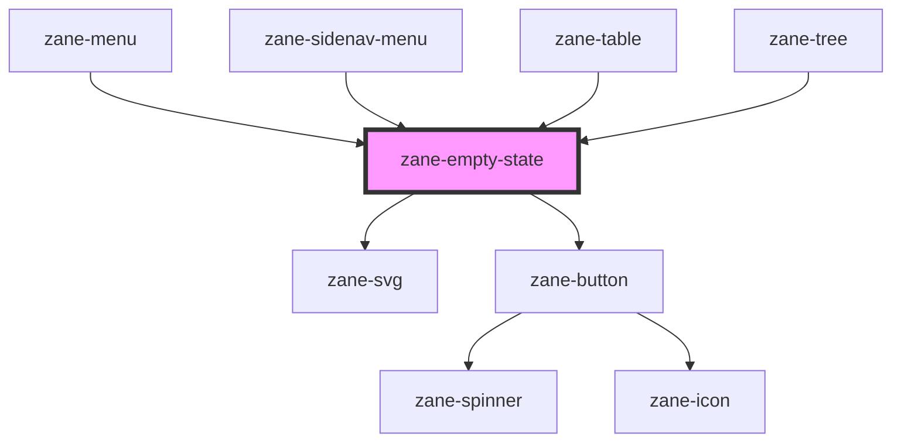

# zane-empty-state

<!-- Auto Generated Below -->

## Overview

空状态(Empty State)组件

用于展示无数据时的占位内容，包含插图、标题、描述和操作按钮

## Properties

| Property | Attribute | Description | Type | Default |
| --- | --- | --- | --- | --- |
| `action` | `action` | 操作按钮文本 当设置此属性时会显示操作按钮 | `string` | `undefined` |
| `actionDisabled` | `action-disabled` | 禁用操作按钮 - true: 禁用操作按钮 - false: 启用操作按钮(默认) | `boolean` | `false` |
| `actionUrl` | `action-url` | 操作按钮跳转链接 设置后会渲染为<a>标签而非<button> | `string` | `undefined` |
| `actionVariant` | `action-variant` | 操作按钮样式变体 - 'default': 默认填充样式 - 'ghost': 幽灵按钮样式 - 'outline': 描边按钮样式(默认) | `"default" \| "ghost" \| "outline"` | `'default'` |
| `description` | `description` | 描述文本 支持HTML内容，会自动进行XSS过滤 | `string` | `undefined` |
| `headline` | `headline` | 标题文本 | `string` | `undefined` |
| `illustration` | `illustration` | 插图名称 对应assets/images/empty-state目录下的SVG文件名 | `string` | `'no-document'` |

## Dependencies

### Used by

- [zane-menu](../../menu/menu)
- [zane-sidenav-menu](../sidenav/sidenav-menu)
- [zane-table](../../table)
- [zane-tree](../../tree/tree)

### Depends on

- [zane-svg](../../svg)
- [zane-button](../../button/button)

### Graph

---

_Built with [StencilJS](https://stenciljs.com/)_
