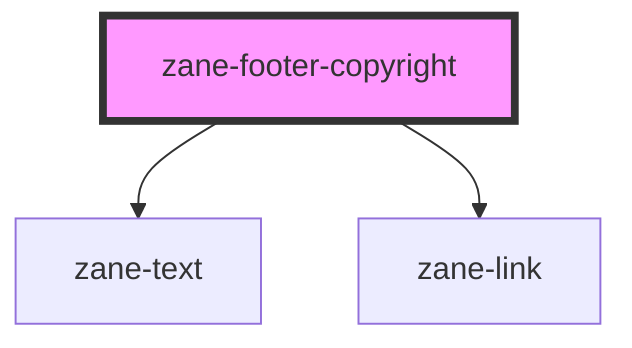

# zane-footer-copyright

<!-- Auto Generated Below -->

## Overview

页脚版权(Footer Copyright)组件

用于展示标准版权声明，包含年份、版权所有者链接和保留权利声明

## Properties

| Property | Attribute | Description | Type | Default |
| --- | --- | --- | --- | --- |
| `copyright` | `copyright` | 版权所有者名称 将显示为可点击链接（当copyrightHref设置时） | `string` | `undefined` |
| `copyrightHref` | `copyright-href` | 版权所有者链接 设置后会将版权名称渲染为可点击链接 | `string` | `undefined` |
| `year` | `year` | 版权年份 默认为当前年份，可通过属性覆盖 | `number` | `new Date().getFullYear()` |

## Dependencies

### Depends on

- [zane-text](../../../text)
- [zane-link](../../../link)

### Graph

---

_Built with [StencilJS](https://stenciljs.com/)_
