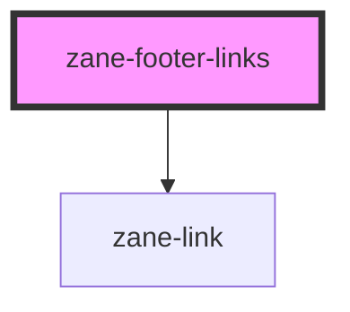

# zane-footer-links

<!-- Auto Generated Below -->

## Overview

页脚链接(Footer Links)组件

用于展示页脚导航链接列表，支持动态链接数据传入

## Properties

| Property | Attribute | Description | Type | Default |
| --- | --- | --- | --- | --- |
| `links` | `links` | 链接数据数组 支持两种格式： 1. 对象数组格式: [{href: string, name: string}] 2. JSON字符串格式: '[{"href":"...","name":"..."}]' | `string \| { href: string; name: string; }[]` | `[]` |

## Dependencies

### Depends on

- [zane-link](../../../link)

### Graph

---

_Built with [StencilJS](https://stenciljs.com/)_
