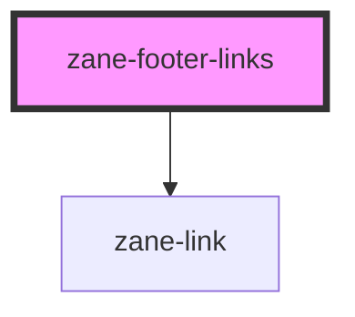

# zane-footer-links

<!-- Auto Generated Below -->

## Properties

| Property | Attribute | Description | Type | Default |
| --- | --- | --- | --- | --- |
| `links` | `links` |  | `{ href: string; name: string; }[]` | `[]` |

## Dependencies

### Depends on

- [zane-link](../../../link)

### Graph

---

_Built with [StencilJS](https://stenciljs.com/)_
