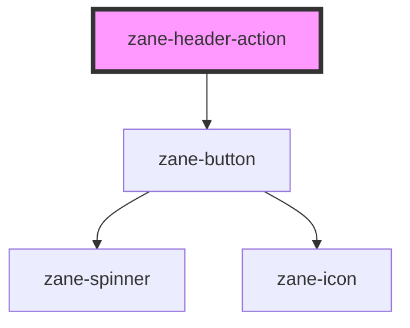

# zane-header-action

<!-- Auto Generated Below -->

## Overview

头部操作按钮组件，用于在头部导航栏中创建可交互的操作项

## Properties

| Property | Attribute | Description | Type | Default |
| --- | --- | --- | --- | --- |
| `badge` | `badge` | 徽标内容 | `string` | `'_self'` |
| `configAria` | `config-aria` | ARIA可访问性配置 | `any` | `{}` |
| `href` | `href` | 链接地址 | `string` | `undefined` |
| `icon` | `icon` | 图标名称 | `string` | `undefined` |
| `selected` | `selected` | 是否选中状态 | `boolean` | `false` |
| `size` | `size` | 按钮尺寸 | `"lg" \| "md" \| "none" \| "sm" \| "xl" \| "xxl"` | `'md'` |
| `target` | `target` | 链接打开方式 | `string` | `'_self'` |

## Methods

### `setColor(color: string) => Promise<void>`

设置按钮颜色

#### Parameters

| Name    | Type     | Description    |
| ------- | -------- | -------------- |
| `color` | `string` | 要设置的颜色值 |

#### Returns

Type: `Promise<void>`

## Dependencies

### Depends on

- [zane-button](../../../button/button)

### Graph

---

_Built with [StencilJS](https://stenciljs.com/)_
