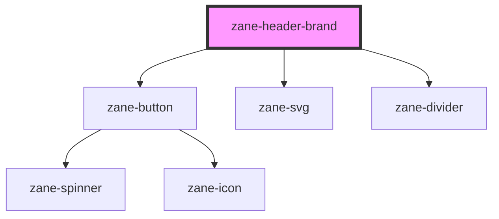

# zane-header-brand

<!-- Auto Generated Below -->

## Overview

头部品牌标识组件，用于显示网站/应用的品牌标识和名称

## Properties

| Property   | Attribute   | Description      | Type     | Default     |
| ---------- | ----------- | ---------------- | -------- | ----------- |
| `href`     | `href`      | 品牌链接地址     | `string` | `'#'`       |
| `logo`     | `logo`      | 品牌logo图片路径 | `string` | `undefined` |
| `name`     | `name`      | 品牌名称         | `string` | `undefined` |
| `subTitle` | `sub-title` | 品牌副标题       | `string` | `undefined` |

## Methods

### `setColor(color: string) => Promise<void>`

设置品牌颜色

#### Parameters

| Name    | Type     | Description    |
| ------- | -------- | -------------- |
| `color` | `string` | 要设置的颜色值 |

#### Returns

Type: `Promise<void>`

## Dependencies

### Depends on

- [zane-button](../../../button/button)
- [zane-svg](../../../svg)
- [zane-divider](../../../divider)

### Graph

---

_Built with [StencilJS](https://stenciljs.com/)_
