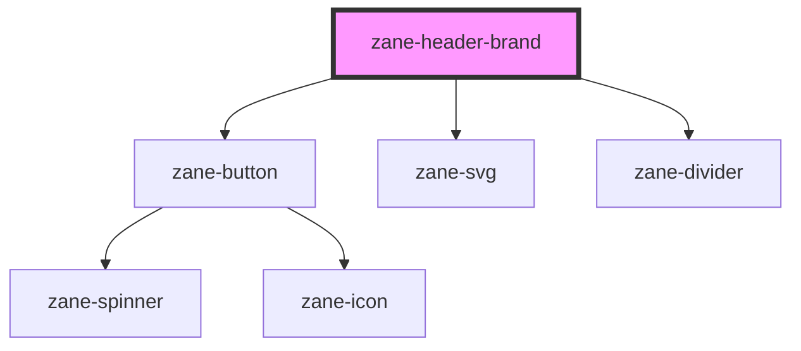

# zane-header-brand

<!-- Auto Generated Below -->

## Properties

| Property   | Attribute   | Description | Type     | Default     |
| ---------- | ----------- | ----------- | -------- | ----------- |
| `href`     | `href`      |             | `string` | `'#'`       |
| `logo`     | `logo`      |             | `string` | `undefined` |
| `name`     | `name`      |             | `string` | `undefined` |
| `subTitle` | `sub-title` |             | `string` | `undefined` |

## Methods

### `setColor(color: string) => Promise<void>`

#### Parameters

| Name    | Type     | Description |
| ------- | -------- | ----------- |
| `color` | `string` |             |

#### Returns

Type: `Promise<void>`

## Dependencies

### Depends on

- [zane-button](../../../button/button)
- [zane-svg](../../../svg)
- [zane-divider](../../../divider)

### Graph

---

_Built with [StencilJS](https://stenciljs.com/)_
