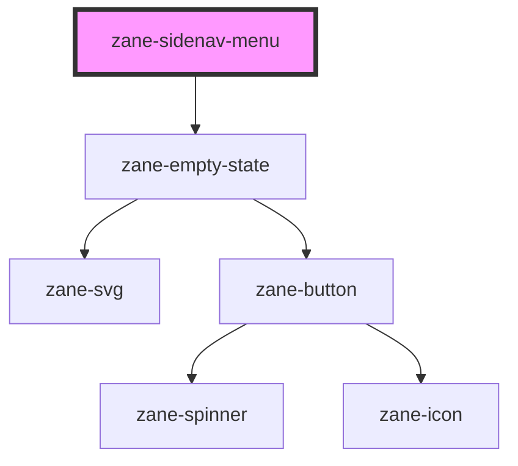

# zane-sidenav-menu

<!-- Auto Generated Below -->

## Overview

侧边导航菜单组件

## Properties

| Property | Attribute | Description | Type | Default |
| --- | --- | --- | --- | --- |
| `empty` | `empty` | 是否显示空状态 | `boolean` | `false` |
| `emptyState` | `empty-state` | 空状态配置(JSON字符串格式) | `any` | `` `{     "headline": "No items",     "description": "There are no items to display"   }` `` |
| `showLoader` | `show-loader` | 是否显示加载指示器 | `boolean` | `false` |
| `value` | `value` | 组件值，可以是数字或字符串 | `number \| string` | `undefined` |

## Methods

### `setFocus() => Promise<void>`

公开方法：设置焦点到第一个菜单项

#### Returns

Type: `Promise<void>`

## Dependencies

### Depends on

- [zane-empty-state](../../empty-state)

### Graph

---

_Built with [StencilJS](https://stenciljs.com/)_
