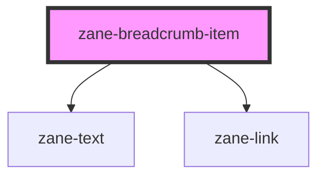

# zane-breadcrumb-item

<!-- Auto Generated Below -->

## Overview

面包屑导航项组件

作为面包屑导航系统的单个项使用，必须作为`zane-breadcrumb`的子元素使用。支持链接导航、活动状态指示和Schema.org 结构化数据。

## Properties

| Property | Attribute | Description | Type | Default |
| --- | --- | --- | --- | --- |
| `active` | `active` | 活动状态标识 表示当前面包屑项是否为活动状态(通常是当前页面)。 当设置为true时，该项会以非链接形式呈现。 | `boolean` | `false` |
| `href` | `href` | 链接目标地址 指定面包屑项的跳转链接。未设置时表示该项不可点击。 当active为true时，此属性会被忽略。 | `string` | `undefined` |
| `position` | `position` | 项在列表中的位置 表示该项在面包屑导航中的序号位置(从1开始)。 用于Schema.org 微数据和样式控制。 | `string` | `undefined` |
| `target` | `target` | 链接打开方式 指定链接的打开方式，等同于HTML的target属性。 常用值: '\_blank'\|'\_self'\|'\_parent'\|'\_top' | `string` | `undefined` |

## Dependencies

### Depends on

- [zane-text](../../text)
- [zane-link](../../link)

### Graph

---

_Built with [StencilJS](https://stenciljs.com/)_
