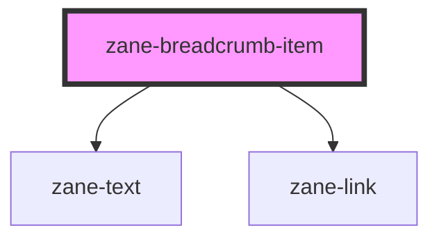

# zane-breadcrumb-item

<!-- Auto Generated Below -->

## Properties

| Property | Attribute | Description | Type | Default |
| --- | --- | --- | --- | --- |
| `active` | `active` |  | `boolean` | `false` |
| `href` | `href` | Hyperlink to navigate to on click. | `string` | `undefined` |
| `position` | `position` |  | `string` | `undefined` |
| `target` | `target` | Sets or retrieves the window or frame at which to target content. | `string` | `undefined` |

## Dependencies

### Depends on

- [zane-text](../../text)
- [zane-link](../../link)

### Graph

---

_Built with [StencilJS](https://stenciljs.com/)_
