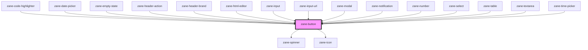

# zane-button

<!-- Auto Generated Below -->

## Overview

多功能按钮组件

提供丰富的交互样式和状态管理，支持：

- 多种视觉变体(variant)
- 完整的大小(size)控制
- 主题颜色(color)系统
- 暗黑模式适配
- 完善的ARIA可访问性
- 图标集成
- 加载状态

## Properties

| Property | Attribute | Description | Type | Default |
| --- | --- | --- | --- | --- |
| `appendData` | `append-data` | 附加数据对象 会在点击事件中回传，用于携带上下文数据 | `any` | `undefined` |
| `color` | `color` | 按钮主题色 支持预设颜色或自定义颜色名称(需在CSS中定义对应变量) | `"black" \| "danger" \| "primary" \| "secondary" \| "success" \| "warning" \| "white"` | `'primary'` |
| `configAria` | `config-aria` | ARIA 可访问性配置 可动态修改并反映到DOM属性 | `any` | `{}` |
| `darkModeColor` | `dark-mode-color` | 暗黑模式下的替代颜色 当检测到暗黑模式时自动切换为此颜色 | `"black" \| "danger" \| "primary" \| "secondary" \| "success" \| "warning" \| "white"` | `undefined` |
| `disabled` | `disabled` | 按钮禁用状态 | `boolean` | `false` |
| `disabledReason` | `disabled-reason` | 禁用原因说明 会以ARIA方式提供给辅助技术，提升可访问性 | `string` | `''` |
| `href` | `href` | 链接地址（使按钮表现为链接） 设置后按钮渲染为 <a> 标签 | `string` | `undefined` |
| `icon` | `icon` | 图标名称 指定要显示的图标，需要配合zane-icon组件使用 | `string` | `undefined` |
| `iconAlign` | `icon-align` | 图标对齐方式 控制图标相对于文本的位置 | `"end" \| "start"` | `'end'` |
| `selected` | `selected` | 按钮选中状态 常用于按钮组或切换场景 | `boolean` | `false` |
| `showLoader` | `show-loader` | 显示加载指示器 设置为true时会显示旋转加载图标并禁用交互 | `boolean` | `false` |
| `size` | `size` | 按钮尺寸 支持从xs到2xl共6种预设尺寸 | `"2xl" \| "lg" \| "md" \| "sm" \| "xl" \| "xs"` | `'md'` |
| `target` | `target` | 链接打开目标（当href存在时有效） | `string` | `'_self'` |
| `throttleDelay` | `throttle-delay` | 点击事件节流延迟(ms) | `number` | `200` |
| `toggle` | `toggle` | 是否为切换型按钮 启用时点击会保持激活状态 | `boolean` | `false` |
| `type` | `type` | 按钮类型（当作为表单按钮时） - 'button': 普通按钮 - 'reset': 表单重置按钮 - 'submit': 表单提交按钮 | `"button" \| "reset" \| "submit"` | `'button'` |
| `variant` | `variant` | 按钮视觉变体 支持基础变体和带.simple后缀的简化变体 | `"default" \| "default.simple" \| "ghost" \| "ghost.simple" \| "light" \| "light.simple" \| "link" \| "link.simple" \| "neo" \| "neo.simple" \| "outline" \| "outline.simple"` | `'default'` |

## Events

| Event | Description | Type |
| --- | --- | --- |
| `zane-button--click` | 按钮点击事件 触发时会返回包含appendData的事件对象 | `CustomEvent<{ appendData: any; }>` |

## Methods

### `setBlur() => Promise<void>`

以编程方式使按钮失去焦点

#### Returns

Type: `Promise<void>`

### `setFocus() => Promise<void>`

以编程方式聚焦按钮

#### Returns

Type: `Promise<void>`

### `triggerClick() => Promise<void>`

以编程方式触发按钮点击

#### Returns

Type: `Promise<void>`

## CSS Custom Properties

| Name | Description |
| --- | --- |
| `--zane-button-border-radius` | Button border radius. |
| `--zane-button-border-style` | Button border style. |
| `--zane-button-color` | Button filling color. |
| `--zane-button-color-active` | Button filling color on active. |
| `--zane-button-color-hover` | Button filling color on hover. |
| `--zane-button-color-light` | Button filling color for light variant. |
| `--zane-button-padding` | Button padding. |
| `--zane-button-support-contrast-color` | Button support color (text or border). Should be white or black based on weight of button filling color. |
| `--zane-theme-button-border-radius` | Theme level button border radius. (applies to all buttons) |
| `--zane-theme-button-border-style` | Theme level button border style. (applies to all buttons) |

## Dependencies

### Used by

- [zane-code-highlighter](../../code-highlighter)
- [zane-date-picker](../../date-picker)
- [zane-empty-state](../../application/empty-state)
- [zane-header-action](../../application/header/header-action)
- [zane-header-brand](../../application/header/header-brand)
- [zane-html-editor](../../html-editor)
- [zane-input](../../input)
- [zane-input-url](../../input-url)
- [zane-modal](../../modal/modal)
- [zane-notification](../../notification)
- [zane-number](../../input-number)
- [zane-select](../../select)
- [zane-table](../../table)
- [zane-textarea](../../textarea)
- [zane-time-picker](../../time-picker)

### Depends on

- [zane-spinner](../../spinner)
- [zane-icon](../../icon)

### Graph

---

_Built with [StencilJS](https://stenciljs.com/)_
