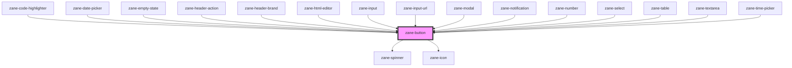

# zane-button

<!-- Auto Generated Below -->

## Properties

| Property | Attribute | Description | Type | Default |
| --- | --- | --- | --- | --- |
| `appendData` | `append-data` | The `appendData` property allows you to attach additional data to the button component. This data can be of any type, making it versatile for various use cases. It's particularly useful for passing extra context or information that can be accessed in event handlers or other component logic. | `any` | `undefined` |
| `color` | `color` | Defines the primary color of the button. This can be set to predefined color names to apply specific color themes. | `"black" \| "danger" \| "primary" \| "secondary" \| "success" \| "warning" \| "white"` | `'primary'` |
| `configAria` | `config-aria` |  | `any` | `{}` |
| `darkModeColor` | `dark-mode-color` | Color variant for dark mode, applicable when [data-theme="dark"] is set. | `"black" \| "danger" \| "primary" \| "secondary" \| "success" \| "warning" \| "white"` | `undefined` |
| `disabled` | `disabled` | If true, the user cannot interact with the button. Defaults to `false`. | `boolean` | `false` |
| `disabledReason` | `disabled-reason` | If button is disabled, the reason why it is disabled. | `string` | `''` |
| `href` | `href` | Hyperlink to navigate to on click. | `string` | `undefined` |
| `icon` | `icon` | Icon which will displayed on button. Possible values are icon names. | `string` | `undefined` |
| `iconAlign` | `icon-align` | Icon alignment. Possible values are `"start"`, `"end"`. Defaults to `"end"`. | `"end" \| "start"` | `'end'` |
| `selected` | `selected` | Button selection state. | `boolean` | `false` |
| `showLoader` | `show-loader` | If true, a loader will be displayed on button. | `boolean` | `false` |
| `size` | `size` | Button size. Possible values are `"sm"`, `"md"`, `"lg"`, `"xl"`, `"2xl"`, `"full"`. Defaults to `"md"`. | `"2xl" \| "lg" \| "md" \| "sm" \| "xl" \| "xs"` | `'md'` |
| `target` | `target` | Sets or retrieves the window or frame at which to target content. | `string` | `'_self'` |
| `throttleDelay` | `throttle-delay` | Sets the delay for throttle in milliseconds. Defaults to 200 milliseconds. | `number` | `200` |
| `toggle` | `toggle` | If true, the button will be in a toggled state. | `boolean` | `false` |
| `type` | `type` | Button type based on which actions are performed when the button is clicked. | `"button" \| "reset" \| "submit"` | `'button'` |
| `variant` | `variant` | The visual style of the button. Possible variant values: `"default"` is a filled button. `"outline"` is an outlined button. `"ghost"` is a transparent button. `"light"` is a light color button. Possible sub-variant values: `"simple"` is a simple button without default padding at end. `"block"` is a full-width button that spans the full width of its container. Mix and match the `variant` and `sub-variant` to create a variety of buttons. `"default.simple"`, `"outline.block"` etc. | `"default" \| "default.simple" \| "ghost" \| "ghost.simple" \| "light" \| "light.simple" \| "link" \| "link.simple" \| "neo" \| "neo.simple" \| "outline" \| "outline.simple"` | `'default'` |

## Events

| Event | Description | Type |
| --- | --- | --- |
| `zane-button--click` | Triggered when the button is clicked. | `CustomEvent<{ appendData: any; }>` |

## Methods

### `setBlur() => Promise<void>`

Sets blur on the native `button` in `zane-button`. Use this method instead of the global `button.blur()`.

#### Returns

Type: `Promise<void>`

### `setFocus() => Promise<void>`

Sets focus on the native `button` in `zane-button`. Use this method instead of the global `button.focus()`.

#### Returns

Type: `Promise<void>`

### `triggerClick() => Promise<void>`

Triggers a click event on the native `button` in `zane-button`. Use this method instead of the global `button.click()`.

#### Returns

Type: `Promise<void>`

## CSS Custom Properties

| Name | Description |
| --- | --- |
| `--zane-button-border-radius` | Button border radius. |
| `--zane-button-border-style` | Button border style. |
| `--zane-button-color` | Button filling color. |
| `--zane-button-color-active` | Button filling color on active. |
| `--zane-button-color-hover` | Button filling color on hover. |
| `--zane-button-color-light` | Button filling color for light variant. |
| `--zane-button-padding` | Button padding. |
| `--zane-button-support-contrast-color` | Button support color (text or border). Should be white or black based on weight of button filling color. |
| `--zane-theme-button-border-radius` | Theme level button border radius. (applies to all buttons) |
| `--zane-theme-button-border-style` | Theme level button border style. (applies to all buttons) |

## Dependencies

### Used by

- [zane-code-highlighter](../../code-highlighter)
- [zane-date-picker](../../date-picker)
- [zane-empty-state](../../application/empty-state)
- [zane-header-action](../../application/header/header-action)
- [zane-header-brand](../../application/header/header-brand)
- [zane-html-editor](../../html-editor)
- [zane-input](../../input)
- [zane-input-url](../../input-url)
- [zane-modal](../../modal/modal)
- [zane-notification](../../notification)
- [zane-number](../../input-number)
- [zane-select](../../select)
- [zane-table](../../table)
- [zane-textarea](../../textarea)
- [zane-time-picker](../../time-picker)

### Depends on

- [zane-spinner](../../spinner)
- [zane-icon](../../icon)

### Graph

---

_Built with [StencilJS](https://stenciljs.com/)_
