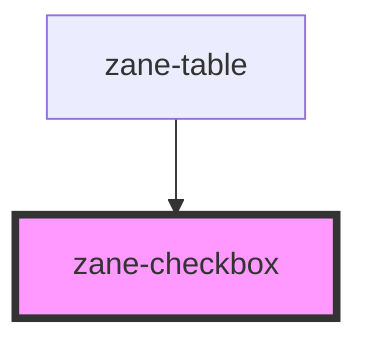

# zane-checkbox

<!-- Auto Generated Below -->

## Overview

自定义复选框组件

实现可定制的复选框控件，支持选中/未选/中间态三种状态，提供完整的ARIA支持、键盘交互和事件响应机制。

## Properties

| Property | Attribute | Description | Type | Default |
| --- | --- | --- | --- | --- |
| `configAria` | `config-aria` | ARIA属性配置对象 用于动态设置ARIA属性（如aria-label, aria-describedby等）， 组件会自动收集元素上所有`aria-*`属性到该对象。 | `any` | `{}` |
| `disabled` | `disabled` | 禁用状态 当设置为`true`时，组件不可交互且视觉上变灰 | `boolean` | `false` |
| `intermediate` | `intermediate` | 中间态状态 当设置为`true`时显示"-"图标，表示部分选中状态， 与`value`属性互斥（中间态时`value`应为false） | `boolean` | `false` |
| `label` | `label` | 复选框标签文本 | `string` | `undefined` |
| `layer` | `layer` | 视觉层级 控制组件在UI中的层级深度，影响阴影和背景色： - `01`: 表层组件（最高层级） - `02`: 中层组件 - `background`: 背景层组件（最低层级） | `"01" \| "02" \| "background"` | `undefined` |
| `name` | `name` | 表单字段名（自动生成） | `string` | `` `zane-input-${this.gid}` `` |
| `readonly` | `readonly` | 只读状态 | `boolean` | `false` |
| `required` | `required` | 必填状态 | `boolean` | `false` |
| `rounded` | `rounded` | 圆角样式 | `boolean` | `false` |
| `size` | `size` | 尺寸规格 - `lg`: 大尺寸(48px) - `md`: 中尺寸(40px) - `sm`: 小尺寸(32px) | `"lg" \| "md" \| "sm"` | `'md'` |
| `value` | `value` | 选中状态 当设置为`true`时显示选中图标， 与`intermediate`属性互斥 | `boolean` | `false` |

## Events

| Event                   | Description  | Type               |
| ----------------------- | ------------ | ------------------ |
| `zane-checkbox--blur`   | 失去焦点事件 | `CustomEvent<any>` |
| `zane-checkbox--change` | 值变更事件   | `CustomEvent<any>` |
| `zane-checkbox--focus`  | 获得焦点事件 | `CustomEvent<any>` |

## Methods

### `getComponentId() => Promise<string>`

获取组件ID

#### Returns

Type: `Promise<string>`

组件唯一标识符

### `setBlur() => Promise<void>`

移除焦点

#### Returns

Type: `Promise<void>`

### `setFocus() => Promise<void>`

设置焦点

#### Returns

Type: `Promise<void>`

## Dependencies

### Used by

- [zane-table](../table)

### Graph

---

_Built with [StencilJS](https://stenciljs.com/)_
