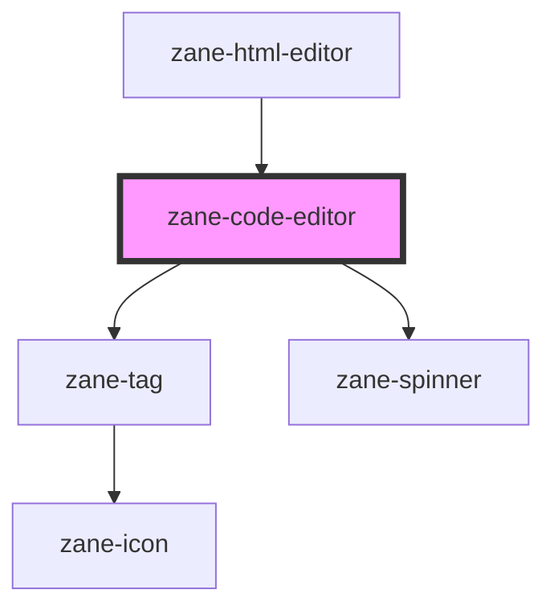

# zane-code-editor

<!-- Auto Generated Below -->

## Properties

| Property | Attribute | Description | Type | Default |
| --- | --- | --- | --- | --- |
| `debounce` | `debounce` | Set the amount of time, in milliseconds, to wait to trigger the `onChange` event after each keystroke. | `number` | `250` |
| `disabled` | `disabled` | If true, the user cannot interact with the button. Defaults to `false`. | `boolean` | `false` |
| `language` | `language` |  | `"html" \| "javascript" \| "json"` | `'javascript'` |
| `libSource` | `lib-source` |  | `any` | `undefined` |
| `lineNumbers` | `line-numbers` |  | `"off" \| "on"` | `'on'` |
| `minimap` | `minimap` |  | `boolean` | `false` |
| `name` | `name` | The input field name. | `string` | `` `zane-input-${this.gid}` `` |
| `readonly` | `readonly` |  | `boolean` | `false` |
| `required` | `required` | If true, required icon is show. Defaults to `false`. | `boolean` | `false` |
| `value` | `value` | The input field value. | `string` | `undefined` |

## Events

| Event | Description | Type |
| --- | --- | --- |
| `zane-code-editor--change` | Emitted when the value has changed. | `CustomEvent<any>` |

## Methods

### `getComponentId() => Promise<string>`

#### Returns

Type: `Promise<string>`

### `setBlur() => Promise<void>`

Sets blur on the native `input` in `zane-input`. Use this method instead of the global `input.blur()`.

#### Returns

Type: `Promise<void>`

### `setFocus() => Promise<void>`

Sets focus on the native `input` in `zane-input`. Use this method instead of the global `input.focus()`.

#### Returns

Type: `Promise<void>`

## Dependencies

### Used by

- [zane-html-editor](../html-editor)

### Depends on

- [zane-tag](../tag)
- [zane-spinner](../spinner)

### Graph

---

_Built with [StencilJS](https://stenciljs.com/)_
