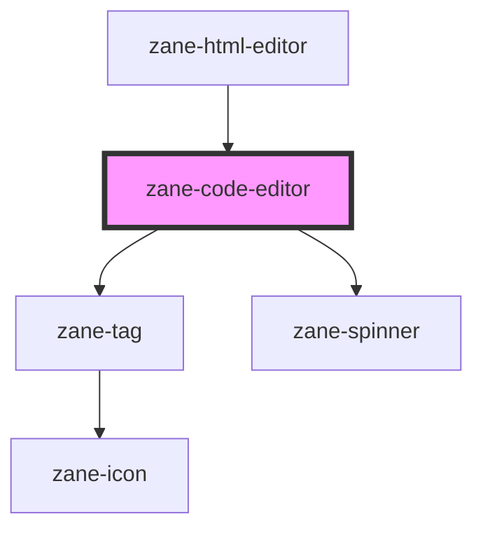

# zane-code-editor

<!-- Auto Generated Below -->

## Overview

基于Monaco Editor的代码编辑器组件

提供语法高亮、智能提示等专业编辑功能，支持暗黑/亮色主题切换，内置防抖机制优化高频变更事件，适用于代码片段展示和实时编辑场景。

## Properties

| Property | Attribute | Description | Type | Default |
| --- | --- | --- | --- | --- |
| `debounce` | `debounce` | 变更事件防抖时间（毫秒） 避免高频输入时频繁触发变更事件， 设置为0可禁用防抖 | `number` | `250` |
| `disabled` | `disabled` | 禁用状态 禁用时编辑器不可编辑但可滚动查看内容 | `boolean` | `false` |
| `language` | `language` | 编程语言支持 支持的语法类型： - `html`: HTML/XML标记语言 - `javascript`: JavaScript/TypeScript - `json`: JSON数据格式 | `"html" \| "javascript" \| "json"` | `'javascript'` |
| `libSource` | `lib-source` | 类型声明库源码 用于提供智能提示的类型定义， 格式应为对应语言的类型声明字符串 | `any` | `undefined` |
| `lineNumbers` | `line-numbers` | 行号显示控制 - `on`: 显示行号 - `off`: 隐藏行号 | `"off" \| "on"` | `'on'` |
| `minimap` | `minimap` | 缩略图显示 在编辑器右侧显示代码导航缩略图 | `boolean` | `false` |
| `name` | `name` | 表单字段名（自动生成） | `string` | `` `zane-input-${this.gid}` `` |
| `readonly` | `readonly` | 只读模式 开启后禁止编辑但保留代码高亮 | `boolean` | `false` |
| `required` | `required` | 必填状态 | `boolean` | `false` |
| `value` | `value` | 编辑器内容 双向绑定的代码文本值 | `string` | `undefined` |

## Events

| Event                      | Description            | Type               |
| -------------------------- | ---------------------- | ------------------ |
| `zane-code-editor--change` | 内容变更事件（带防抖） | `CustomEvent<any>` |

## Methods

### `getComponentId() => Promise<string>`

获取组件ID

#### Returns

Type: `Promise<string>`

组件唯一标识符

### `setBlur() => Promise<void>`

移除编辑器焦点

#### Returns

Type: `Promise<void>`

### `setFocus() => Promise<void>`

设置编辑器焦点

#### Returns

Type: `Promise<void>`

## Dependencies

### Used by

- [zane-html-editor](../html-editor)

### Depends on

- [zane-tag](../tag)
- [zane-spinner](../spinner)

### Graph

---

_Built with [StencilJS](https://stenciljs.com/)_
