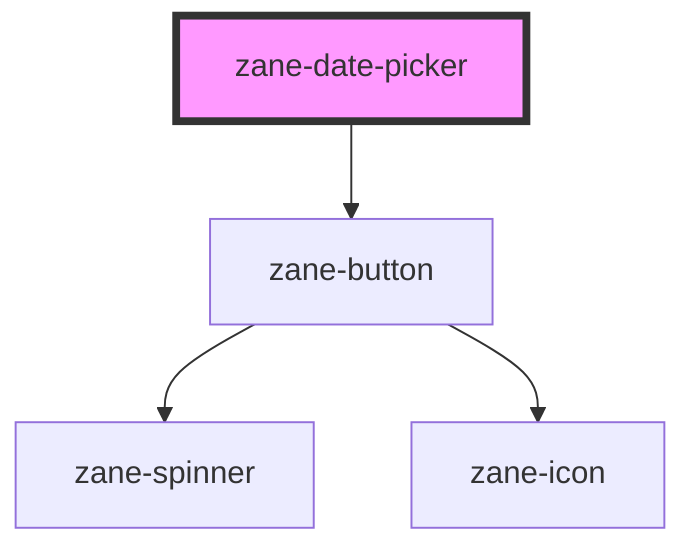

# zane-date-picker

<!-- Auto Generated Below -->

## Overview

日期选择器组件

## Properties

| Property | Attribute | Description | Type | Default |
| --- | --- | --- | --- | --- |
| `configAria` | `config-aria` | ARIA无障碍属性配置对象 用于存储所有aria-\*属性 | `any` | `{}` |
| `debounce` | `debounce` | 事件防抖时间(毫秒) 用于控制change事件的触发频率 | `number` | `300` |
| `disabled` | `disabled` | 是否禁用组件 | `boolean` | `false` |
| `helperText` | `helper-text` | 辅助文本 显示在输入框下方的帮助信息 | `string` | `undefined` |
| `inline` | `inline` | 是否为内联模式 | `boolean` | `false` |
| `invalid` | `invalid` | 是否为无效状态 | `boolean` | `false` |
| `invalidText` | `invalid-text` | 无效状态提示文本 | `string` | `undefined` |
| `label` | `label` | 标签文本 | `string` | `undefined` |
| `name` | `name` | 输入框name属性 默认值为"zane-input-{唯一ID}" | `string` | `` `zane-input-${this.gid}` `` |
| `placeholder` | `placeholder` | 占位符文本 | `string` | `undefined` |
| `readonly` | `readonly` | 是否为只读状态 | `boolean` | `false` |
| `required` | `required` | 是否为必填项 | `boolean` | `false` |
| `size` | `size` | 组件尺寸 - 'lg': 大尺寸 - 'md': 中等尺寸(默认) - 'sm': 小尺寸 | `"lg" \| "md" \| "sm"` | `'md'` |
| `value` | `value` | 当前值 可以是null、number或string类型 | `number \| string` | `''` |
| `warn` | `warn` | 是否为警告状态 | `boolean` | `false` |
| `warnText` | `warn-text` | 警告状态提示文本 | `string` | `undefined` |

## Events

| Event                      | Description        | Type               |
| -------------------------- | ------------------ | ------------------ |
| `zane-date-picker--blur`   | 失去焦点事件       | `CustomEvent<any>` |
| `zane-date-picker--change` | 值变化事件(带防抖) | `CustomEvent<any>` |
| `zane-date-picker--focus`  | 获得焦点事件       | `CustomEvent<any>` |
| `zane-date-picker--input`  | 输入事件(实时触发) | `CustomEvent<any>` |

## Methods

### `getComponentId() => Promise<string>`

获取组件ID的公共方法

#### Returns

Type: `Promise<string>`

组件唯一ID

### `setBlur() => Promise<void>`

设置失去焦点的公共方法

#### Returns

Type: `Promise<void>`

### `setFocus() => Promise<void>`

设置获得焦点的公共方法

#### Returns

Type: `Promise<void>`

## Dependencies

### Depends on

- [zane-button](../button/button)

### Graph

---

_Built with [StencilJS](https://stenciljs.com/)_
