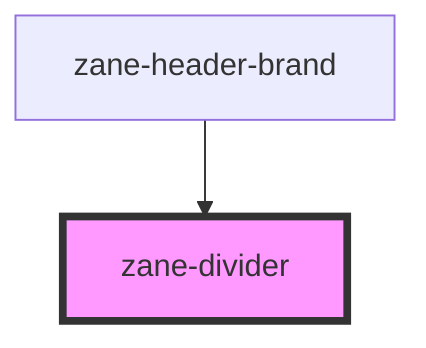

# zane-divider

<!-- Auto Generated Below -->

## Overview

分割线组件

## Properties

| Property   | Attribute  | Description    | Type      | Default |
| ---------- | ---------- | -------------- | --------- | ------- |
| `vertical` | `vertical` | 是否为垂直方向 | `boolean` | `false` |

## CSS Custom Properties

| Name                     | Description            |
| ------------------------ | ---------------------- |
| `--zane-divider-color`   | Color of the divider   |
| `--zane-divider-padding` | Padding of the divider |

## Dependencies

### Used by

- [zane-header-brand](../application/header/header-brand)

### Graph

---

_Built with [StencilJS](https://stenciljs.com/)_
