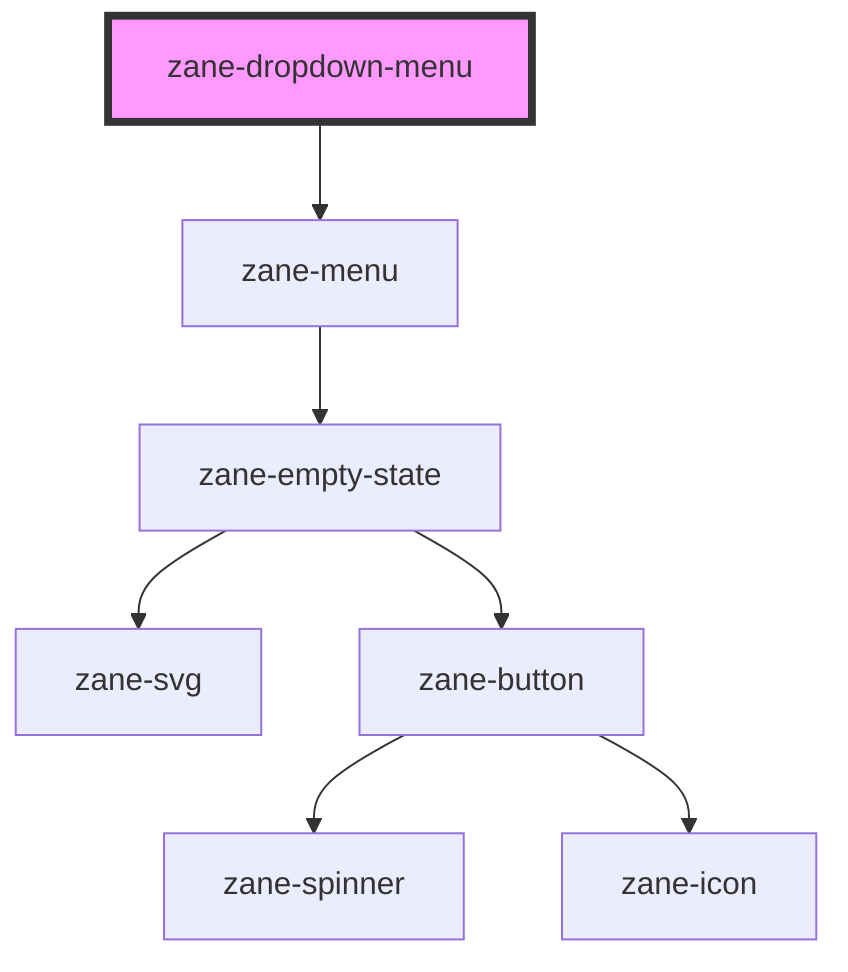

# zane-dropdown-menu

<!-- Auto Generated Below -->

## Overview

下拉菜单内容组件（需与zane-dropdown配合使用）

## Methods

### `setFocus() => Promise<void>`

设置焦点的公共方法将焦点设置到菜单组件

#### Returns

Type: `Promise<void>`

## CSS Custom Properties

| Name                              | Description                |
| --------------------------------- | -------------------------- |
| `--zane-dropdown-menu-max-height` | Maximum height of the menu |

## Dependencies

### Depends on

- [zane-menu](../../menu/menu)

### Graph

---

_Built with [StencilJS](https://stenciljs.com/)_
