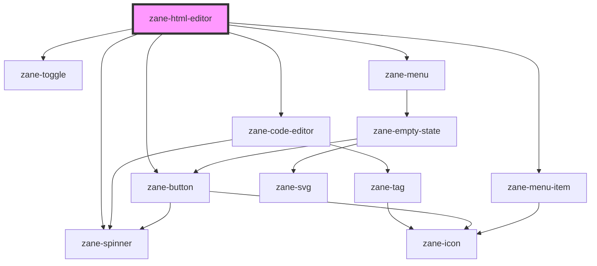

# zane-html-editor

<!-- Auto Generated Below -->

## Overview

基于 Tiptap 的富文本编辑器组件，支持：

- HTML 源码编辑
- Mention（@提及）自动补全功能
- 内置工具条（加粗、斜体、列表等）
- 主题切换（vs-dark / vs-light）
- 可视化编辑与 HTML 源码切换
- 与表单集成（name、required、readonly 等属性）

## Properties

| Property | Attribute | Description | Type | Default |
| --- | --- | --- | --- | --- |
| `debounce` | `debounce` | 设置事件触发的防抖时间（毫秒），用于优化 `zaneChange` 事件的触发频率。 默认值：250。 | `number` | `250` |
| `disabled` | `disabled` | 控制编辑器是否禁用。 - `true`：编辑器不可编辑。 - `false`：编辑器可编辑（默认）。 | `boolean` | `false` |
| `layer` | `layer` | 设置组件的层级样式类，用于区分不同视觉层级的组件。 可选值： - '01'：主层级，视觉权重最高（如模态框） - '02'：次级层级，用于普通组件 - 'background'：背景层级，通常用于遮罩、背景等 | `"01" \| "02" \| "background"` | `undefined` |
| `lineNumbers` | `line-numbers` | 设置是否在代码编辑器中显示行号。 - 'on'：显示行号（默认） - 'off'：不显示行号 | `"off" \| "on"` | `'on'` |
| `mentions` | `mentions` |  | `{ label: string; value: string; }[]` | `[]` |
| `mentionsSearch` | `mentions-search` | 配置 Mention 提及功能的搜索方式。 - 'contains'：使用本地数组进行模糊匹配（适合静态数据） - 'managed'：通过事件 `zane-html-editor--search` 获取动态数据（适合异步搜索） | `"contains" \| "managed"` | `'contains'` |
| `name` | `name` | 表单字段名称，用于提交或获取数据。 默认值：`zane-input-<index>`，其中 `<index>` 为组件唯一标识符。 | `string` | `` `zane-input-${this.gid}` `` |
| `placeholder` | `placeholder` | 编辑器的占位文本（未输入内容时显示的提示文本）。 | `string` | `undefined` |
| `readonly` | `readonly` | 设置编辑器是否为只读模式。 - `true`：用户不能修改内容 - `false`：用户可编辑（默认） | `boolean` | `false` |
| `required` | `required` | 设置是否为必填字段，通常用于表单验证。 - `true`：必须输入 - `false`：非必填（默认） | `boolean` | `false` |
| `showSuggestionCharacter` | `show-suggestion-character` |  | `boolean` | `true` |
| `showToolbar` | `show-toolbar` |  | `boolean` | `true` |
| `suggestionCharacter` | `suggestion-character` |  | `string` | `'@'` |
| `theme` | `theme` | 设置编辑器的外观主题。 - 'vs-dark'：深色主题 - 'vs-light'：浅色主题（默认） | `"vs-dark" \| "vs-light"` | `'vs-light'` |
| `value` | `value` | 设置或获取富文本编辑器的当前内容值（HTML 字符串）。 | `string` | `undefined` |

## Events

| Event | Description | Type |
| --- | --- | --- |
| `zane-html-editor--change` | 当编辑器内容发生变化时触发该事件。 事件参数格式：`{ value: string }`，其中 `value` 为当前 HTML 内容。 | `CustomEvent<any>` |
| `zane-html-editor--search` | 当 Mention 提及功能需要异步搜索时触发该事件。 事件参数格式：`{ query: string, callback: (mentions: { label: string; value: string }[]) => void }`。 开发者需通过 `callback` 返回匹配的 Mention 数据。 | `CustomEvent<any>` |

## Methods

### `getComponentId() => Promise<string>`

获取组件的唯一标识符（GID）。用于生成唯一 name 属性或用于调试。

#### Returns

Type: `Promise<string>`

### `setBlur() => Promise<void>`

手动设置编辑器失去焦点。

#### Returns

Type: `Promise<void>`

### `setFocus() => Promise<void>`

手动设置编辑器获得焦点。

#### Returns

Type: `Promise<void>`

## Dependencies

### Depends on

- [zane-spinner](../spinner)
- [zane-code-editor](../code-editor)
- [zane-toggle](../toggle)
- [zane-menu](../menu/menu)
- [zane-menu-item](../menu/menu-item)
- [zane-button](../button/button)

### Graph

---

_Built with [StencilJS](https://stenciljs.com/)_
