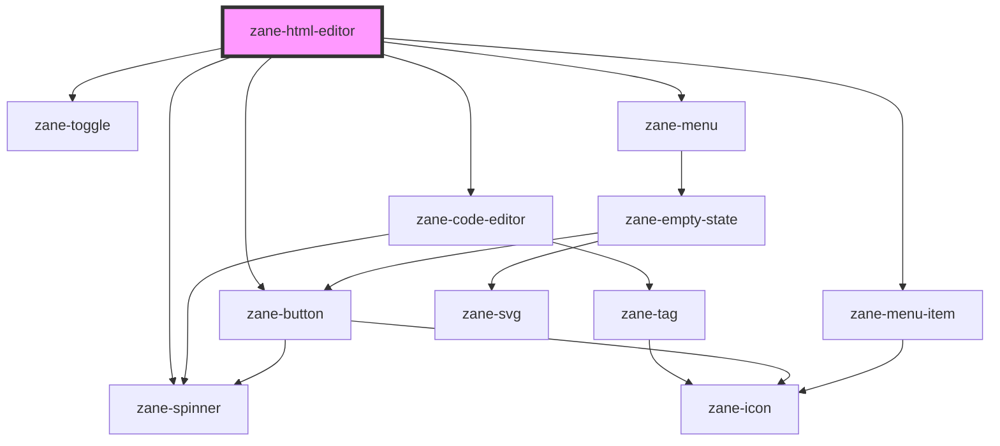

# zane-html-editor

<!-- Auto Generated Below -->

## Properties

| Property | Attribute | Description | Type | Default |
| --- | --- | --- | --- | --- |
| `debounce` | `debounce` | Set the amount of time, in milliseconds, to wait to trigger the `onChange` event after each keystroke. | `number` | `250` |
| `disabled` | `disabled` | If true, the user cannot interact with the button. Defaults to `false`. | `boolean` | `false` |
| `layer` | `layer` |  | `"01" \| "02" \| "background"` | `undefined` |
| `lineNumbers` | `line-numbers` |  | `"off" \| "on"` | `'on'` |
| `mentions` | `mentions` |  | `{ label: string; value: string; }[]` | `[]` |
| `mentionsSearch` | `mentions-search` |  | `"contains" \| "managed"` | `'contains'` |
| `name` | `name` | The input field name. | `string` | `` `zane-input-${this.gid}` `` |
| `placeholder` | `placeholder` | The input field placeholder. | `string` | `undefined` |
| `readonly` | `readonly` |  | `boolean` | `false` |
| `required` | `required` | If true, required icon is show. Defaults to `false`. | `boolean` | `false` |
| `showSuggestionCharacter` | `show-suggestion-character` |  | `boolean` | `true` |
| `showToolbar` | `show-toolbar` |  | `boolean` | `true` |
| `suggestionCharacter` | `suggestion-character` |  | `string` | `'@'` |
| `theme` | `theme` |  | `"vs-dark" \| "vs-light"` | `'vs-light'` |
| `value` | `value` | The input field value. | `string` | `undefined` |

## Events

| Event | Description | Type |
| --- | --- | --- |
| `zane-html-editor--change` | Emitted when the value has changed.. | `CustomEvent<any>` |
| `zane-html-editor--search` | Emitted when a keyboard input occurred. | `CustomEvent<any>` |

## Methods

### `getComponentId() => Promise<string>`

#### Returns

Type: `Promise<string>`

### `setBlur() => Promise<void>`

Sets blur on the native `input` in `zane-input`. Use this method instead of the global `input.blur()`.

#### Returns

Type: `Promise<void>`

### `setFocus() => Promise<void>`

Sets focus on the native `input` in `zane-input`. Use this method instead of the global `input.focus()`.

#### Returns

Type: `Promise<void>`

## Dependencies

### Depends on

- [zane-spinner](../spinner)
- [zane-code-editor](../code-editor)
- [zane-toggle](../toggle)
- [zane-menu](../menu/menu)
- [zane-menu-item](../menu/menu-item)
- [zane-button](../button/button)

### Graph

---

_Built with [StencilJS](https://stenciljs.com/)_
