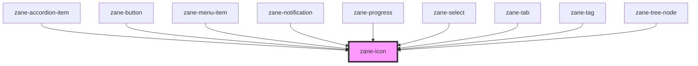

# zane-icon

<!-- Auto Generated Below -->

## Properties

| Property | Attribute | Description | Type | Default |
| --- | --- | --- | --- | --- |
| `name` | `name` | The identifier for the icon. This name corresponds to a specific SVG asset in the icon set. | `string` | `undefined` |
| `size` | `size` | The size of the icon. This can be specified in pixels (px) or rem units to control the icon's dimensions. If a number is provided, it will be treated as rem units. For example, '16px', '2rem', or 2 would be valid values. | `string` | `undefined` |

## CSS Custom Properties

| Name                                                         | Description |
| ------------------------------------------------------------ | ----------- |
| `--goat-icon-size - The size of the icon (height and width)` |             |

## Dependencies

### Used by

- [zane-accordion-item](../accordion/accordion-item)
- [zane-button](../button/button)
- [zane-menu-item](../menu/menu-item)
- [zane-notification](../notification)
- [zane-progress](../progress)
- [zane-select](../select)
- [zane-tab](../tabs/tab)
- [zane-tag](../tag)
- [zane-tree-node](../tree/tree-node)

### Graph

---

_Built with [StencilJS](https://stenciljs.com/)_
