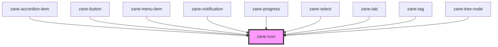

# zane-icon

<!-- Auto Generated Below -->

## Overview

图标组件（zane-icon）该组件基于 Stencil 构建，用于按需异步加载并渲染 SVG 图标。支持通过属性 name 指定图标名称，通过 size 控制图标尺寸。组件内部使用 Shadow DOM 实现样式隔离，并暴露 CSS 自定义属性 `--zane-icon-size` 供外部覆盖默认尺寸。

## Properties

| Property | Attribute | Description | Type | Default |
| --- | --- | --- | --- | --- |
| `name` | `name` | 图标名称，对应图标库中的文件名。 当该值发生变化时，组件会重新异步加载对应 SVG。 | `string` | `undefined` |
| `size` | `size` | 图标尺寸。 - 可选内置枚举：'xs' \| 'sm' \| 'md' \| 'lg' \| 'xl' - 也可传入任意合法的 CSS 长度值（如 "24px"、"1.5rem"）或纯数字字符串（如 "2"）。 | `string` | `undefined` |

## CSS Custom Properties

| Name                                                         | Description |
| ------------------------------------------------------------ | ----------- |
| `--goat-icon-size - The size of the icon (height and width)` |             |

## Dependencies

### Used by

- [zane-accordion-item](../accordion/accordion-item)
- [zane-button](../button/button)
- [zane-menu-item](../menu/menu-item)
- [zane-notification](../notification)
- [zane-progress](../progress)
- [zane-select](../select)
- [zane-tab](../tabs/tab)
- [zane-tag](../tag)
- [zane-tree-node](../tree/tree-node)

### Graph

---

_Built with [StencilJS](https://stenciljs.com/)_
