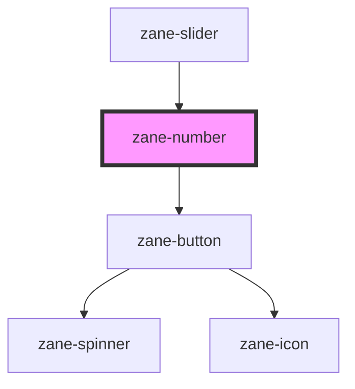

# zane-number

<!-- Auto Generated Below -->

## Overview

数字输入框组件 zane-number

核心功能：

1. 支持数字输入及增减按钮控制
2. 提供四种状态反馈（默认/成功/警告/错误）
3. 表单验证支持（必填/禁用/只读）
4. 防抖事件处理与无障碍访问优化
5. 插槽扩展能力（前后扩展区域）

## Properties

| Property | Attribute | Description | Type | Default |
| --- | --- | --- | --- | --- |
| `autocomplete` | `autocomplete` | 自动填充控制 - `on`: 允许浏览器自动填充 - `off`: 禁用自动填充 | `"off" \| "on"` | `'off'` |
| `configAria` | `config-aria` |  | `any` | `{}` |
| `debounce` | `debounce` | 防抖延迟(ms) - 控制 zane-number--change 事件触发频率 | `number` | `300` |
| `disabled` | `disabled` |  | `boolean` | `false` |
| `helperText` | `helper-text` |  | `string` | `undefined` |
| `hideActions` | `hide-actions` | 操作按钮可见性控制 - true: 隐藏增减按钮 - false: 显示（默认） | `boolean` | `false` |
| `inline` | `inline` |  | `boolean` | `false` |
| `invalid` | `invalid` |  | `boolean` | `false` |
| `invalidText` | `invalid-text` |  | `string` | `undefined` |
| `label` | `label` |  | `string` | `undefined` |
| `name` | `name` |  | `string` | `` `zane-input-${this.gid}` `` |
| `placeholder` | `placeholder` |  | `string` | `undefined` |
| `readonly` | `readonly` |  | `boolean` | `false` |
| `required` | `required` |  | `boolean` | `false` |
| `size` | `size` | 尺寸规格 - `sm`: 小尺寸(高度约32px) - `md`: 中尺寸(高度约40px) - `lg`: 大尺寸(高度约48px) | `"lg" \| "md" \| "sm"` | `'md'` |
| `skeleton` | `skeleton` |  | `boolean` | `false` |
| `state` | `state` | 组件状态标识 - `default`: 默认状态（无特殊样式） - `success`: 成功状态（通常用绿色标识） - `warning`: 警告状态（通常用橙色标识） - `error`: 错误状态（通常用红色标识） | `"default" \| "error" \| "success" \| "warning"` | `'default'` |
| `value` | `value` | 输入值（数字类型） - 支持 null 表示空值 - 使用 mutable 实现双向绑定 | `number` | `null` |
| `warn` | `warn` |  | `boolean` | `false` |
| `warnText` | `warn-text` |  | `string` | `undefined` |

## Events

| Event                 | Description              | Type               |
| --------------------- | ------------------------ | ------------------ |
| `zane-number--blur`   | 失去焦点事件             | `CustomEvent<any>` |
| `zane-number--change` | 数字变化事件（防抖处理） | `CustomEvent<any>` |
| `zane-number--focus`  | 获得焦点事件             | `CustomEvent<any>` |
| `zane-number--input`  | 实时输入事件             | `CustomEvent<any>` |

## Methods

### `getComponentId() => Promise<string>`

获取组件全局唯一标识

#### Returns

Type: `Promise<string>`

组件ID

### `setBlur() => Promise<void>`

#### Returns

Type: `Promise<void>`

### `setFocus() => Promise<void>`

#### Returns

Type: `Promise<void>`

## Shadow Parts

| Part      | Description                            |
| --------- | -------------------------------------- |
| `"input"` | 原生输入框元素（可通过::part CSS定制） |

## Dependencies

### Used by

- [zane-slider](../slider)

### Depends on

- [zane-button](../button/button)

### Graph

---

_Built with [StencilJS](https://stenciljs.com/)_
