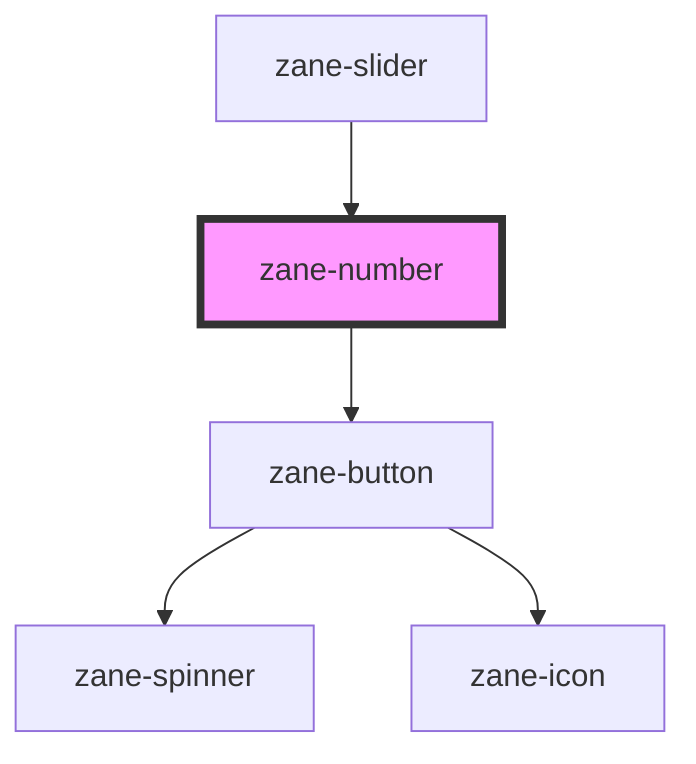

# zane-number

<!-- Auto Generated Below -->

## Properties

| Property | Attribute | Description | Type | Default |
| --- | --- | --- | --- | --- |
| `autocomplete` | `autocomplete` | Indicates whether the value of the control can be automatically completed by the browser. | `"off" \| "on"` | `'off'` |
| `configAria` | `config-aria` |  | `any` | `{}` |
| `debounce` | `debounce` | Set the amount of time, in milliseconds, to wait to trigger the `zaneChange` event after each keystroke. | `number` | `300` |
| `disabled` | `disabled` | If true, the user cannot interact with the button. Defaults to `false`. | `boolean` | `false` |
| `helperText` | `helper-text` |  | `string` | `undefined` |
| `hideActions` | `hide-actions` |  | `boolean` | `false` |
| `inline` | `inline` |  | `boolean` | `false` |
| `invalid` | `invalid` |  | `boolean` | `false` |
| `invalidText` | `invalid-text` |  | `string` | `undefined` |
| `label` | `label` |  | `string` | `undefined` |
| `name` | `name` | The input field name. | `string` | `` `zane-input-${this.gid}` `` |
| `placeholder` | `placeholder` | The input field placeholder. | `string` | `undefined` |
| `readonly` | `readonly` | If true, the user read the value cannot modify it. Defaults to `false`. | `boolean` | `false` |
| `required` | `required` | If true, required icon is show. Defaults to `false`. | `boolean` | `false` |
| `size` | `size` | The input field size. Possible values are: `"sm"`, `"md"`, `"lg"`. Defaults to `"md"`. | `"lg" \| "md" \| "sm"` | `'md'` |
| `skeleton` | `skeleton` |  | `boolean` | `false` |
| `state` | `state` | The input state. Possible values are: `"success"`, `"error"`, `"warning"`, 'default'. Defaults to `"default"`. | `"default" \| "error" \| "success" \| "warning"` | `'default'` |
| `value` | `value` | The input field value. | `number` | `null` |
| `warn` | `warn` |  | `boolean` | `false` |
| `warnText` | `warn-text` |  | `string` | `undefined` |

## Events

| Event | Description | Type |
| --- | --- | --- |
| `zane-number--blur` | Emitted when the input loses focus. | `CustomEvent<any>` |
| `zane-number--change` | Emitted when the value has changed. | `CustomEvent<any>` |
| `zane-number--focus` | Emitted when the input has focus. | `CustomEvent<any>` |
| `zane-number--input` | Emitted when a keyboard input occurred. | `CustomEvent<any>` |

## Methods

### `getComponentId() => Promise<string>`

#### Returns

Type: `Promise<string>`

### `setBlur() => Promise<void>`

Sets blur on the native `input` in `zane-input`. Use this method instead of the global `input.blur()`.

#### Returns

Type: `Promise<void>`

### `setFocus() => Promise<void>`

Sets focus on the native `input` in `zane-input`. Use this method instead of the global `input.focus()`.

#### Returns

Type: `Promise<void>`

## Dependencies

### Used by

- [zane-slider](../slider)

### Depends on

- [zane-button](../button/button)

### Graph

---

_Built with [StencilJS](https://stenciljs.com/)_
