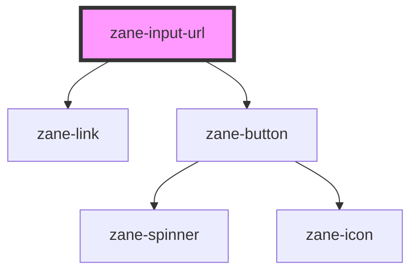

# zane-input-url

<!-- Auto Generated Below -->

## Properties

| Property | Attribute | Description | Type | Default |
| --- | --- | --- | --- | --- |
| `debounce` | `debounce` | Set the amount of time, in milliseconds, to wait to trigger the `valueChange` event after each keystroke. | `number` | `300` |
| `disabled` | `disabled` | If true, the user cannot interact with the input. Defaults to `false`. | `boolean` | `false` |
| `editing` | `editing` |  | `boolean` | `false` |
| `name` | `name` | The input field name. | `string` | `` `zane-input-url-${this.gid}` `` |
| `placeholder` | `placeholder` | The input field placeholder. | `string` | `undefined` |
| `size` | `size` | The input field size. Possible values are: `"sm"`, `"md"`, `"lg"`. Defaults to `"md"`. | `"lg" \| "md" \| "sm"` | `'md'` |
| `value` | `value` | The input field value. | `string` | `undefined` |

## Events

| Event | Description | Type |
| --- | --- | --- |
| `inputInvalid` | Emitted when the URL input is invalid. | `CustomEvent<boolean>` |
| `valueChange` | Emitted when a keyboard input occurred. | `CustomEvent<string>` |

## Methods

### `getComponentId() => Promise<string>`

Get the component's unique ID

#### Returns

Type: `Promise<string>`

### `setBlur() => Promise<void>`

Sets blur on the native `input`. Use this method instead of the global `input.blur()`.

#### Returns

Type: `Promise<void>`

### `setFocus() => Promise<void>`

Sets focus on the native `input`. Use this method instead of the global `input.focus()`.

#### Returns

Type: `Promise<void>`

## Dependencies

### Depends on

- [zane-link](../link)
- [zane-button](../button/button)

### Graph

---

_Built with [StencilJS](https://stenciljs.com/)_
