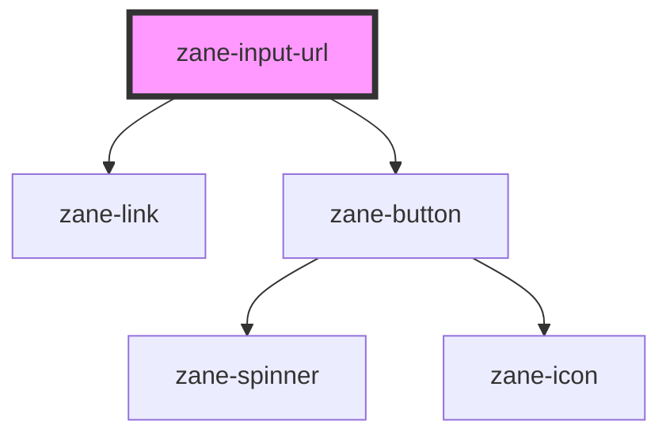

# zane-input-url

<!-- Auto Generated Below -->

## Overview

双模式URL输入组件

## Properties

| Property | Attribute | Description | Type | Default |
| --- | --- | --- | --- | --- |
| `debounce` | `debounce` | 值变化事件的防抖时间（毫秒） | `number` | `300` |
| `disabled` | `disabled` | 禁用状态 | `boolean` | `false` |
| `editing` | `editing` | 编辑模式状态 | `boolean` | `false` |
| `name` | `name` | 输入框名称属性 | `string` | `` `zane-input-url-${this.gid}` `` |
| `placeholder` | `placeholder` | 输入框占位文本 | `string` | `undefined` |
| `size` | `size` | 组件尺寸规格 | `"lg" \| "md" \| "sm"` | `'md'` |
| `value` | `value` | 输入值 | `string` | `undefined` |

## Events

| Event          | Description  | Type                   |
| -------------- | ------------ | ---------------------- |
| `inputInvalid` | 输入无效事件 | `CustomEvent<boolean>` |
| `valueChange`  | 值变化事件   | `CustomEvent<string>`  |

## Methods

### `getComponentId() => Promise<string>`

获取组件唯一标识符

#### Returns

Type: `Promise<string>`

组件全局唯一ID

### `setBlur() => Promise<void>`

移除输入框焦点

#### Returns

Type: `Promise<void>`

### `setFocus() => Promise<void>`

设置输入框焦点

#### Returns

Type: `Promise<void>`

## Dependencies

### Depends on

- [zane-link](../link)
- [zane-button](../button/button)

### Graph

---

_Built with [StencilJS](https://stenciljs.com/)_
