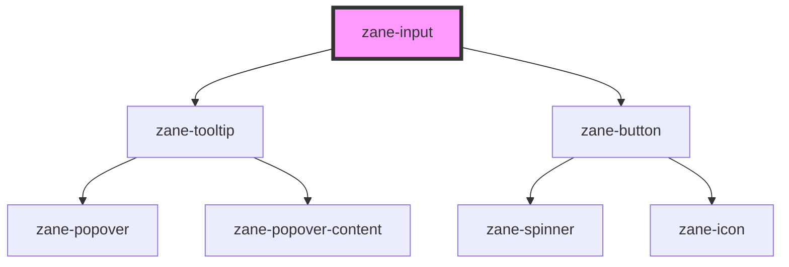

# zane-input

<!-- Auto Generated Below -->

## Overview

自定义输入框组件 zane-input

实现功能：

1. 支持多种输入类型（文本、密码、邮箱等）及尺寸控制
2. 包含表单验证状态（错误/警告）及辅助文本展示
3. 提供前后插槽(start/end)扩展能力
4. 支持防抖事件处理与无障碍访问
5. 集成密码可见性切换功能

## Properties

| Property | Attribute | Description | Type | Default |
| --- | --- | --- | --- | --- |
| `autocomplete` | `autocomplete` | 自动填充控制 - `on`: 允许浏览器自动填充 - `off`: 禁用自动填充 | `"off" \| "on"` | `'off'` |
| `configAria` | `config-aria` | 动态ARIA属性配置对象 - 收集宿主元素上所有`aria-*`属性并转移到内部input元素 - 需通过mutable允许组件内修改 | `any` | `{}` |
| `debounce` | `debounce` | 输入内容变化事件(zane-input--change)的防抖延迟(ms) | `number` | `300` |
| `disabled` | `disabled` | 禁用状态 - 设置后阻止用户交互 | `boolean` | `false` |
| `helperText` | `helper-text` | 辅助说明文本 - 在非错误/警告状态下显示 | `string` | `undefined` |
| `inline` | `inline` | 行内布局模式 - 设置后标签与输入框水平排列 | `boolean` | `false` |
| `invalid` | `invalid` | 验证失败状态 - 激活时会显示invalidText并应用错误样式 | `boolean` | `false` |
| `invalidText` | `invalid-text` | 验证失败提示文本 - 当invalid=true时显示 | `string` | `undefined` |
| `label` | `label` | 输入框标签文本 - 显示在输入区域上方 | `string` | `undefined` |
| `name` | `name` | 输入框名称 - 用于表单提交时识别字段 - 默认生成唯一ID: zane-input-{gid} | `string` | `` `zane-input-${this.gid}` `` |
| `placeholder` | `placeholder` | 占位提示文本 | `string` | `undefined` |
| `readonly` | `readonly` | 只读状态 - 允许查看但禁止修改内容 | `boolean` | `false` |
| `required` | `required` | 必填标识 - 显示红色星号(\*)并触发浏览器原生验证 | `boolean` | `false` |
| `size` | `size` | 尺寸控制 - `sm`: 小尺寸(高度32px) - `md`: 中尺寸(高度40px) - `lg`: 大尺寸(高度48px) | `"lg" \| "md" \| "sm"` | `'md'` |
| `skeleton` | `skeleton` | 骨架屏模式 - 加载状态时显示灰色占位块 | `boolean` | `false` |
| `type` | `type` | 输入类型 - `text`: 普通文本 - `password`: 密码(带可见切换按钮) - `email`: 邮箱格式验证 - `tel`: 电话号码输入 | `"email" \| "password" \| "tel" \| "text"` | `'text'` |
| `value` | `value` | 输入框值 - 使用双向数据绑定 | `string` | `undefined` |
| `warn` | `warn` | 警告状态 - 非致命性错误提示，显示warnText | `boolean` | `false` |
| `warnText` | `warn-text` | 警告提示文本 - 当warn=true时显示 | `string` | `undefined` |

## Events

| Event                | Description        | Type               |
| -------------------- | ------------------ | ------------------ |
| `zane-input--blur`   | 失去焦点事件       | `CustomEvent<any>` |
| `zane-input--change` | 防抖后的值变更事件 | `CustomEvent<any>` |
| `zane-input--focus`  | 获得焦点事件       | `CustomEvent<any>` |
| `zane-input--input`  | 实时输入事件       | `CustomEvent<any>` |

## Methods

### `getComponentId() => Promise<string>`

获取组件唯一ID

#### Returns

Type: `Promise<string>`

组件全局唯一标识(gid)

### `setBlur() => Promise<void>`

移除输入框焦点

- 同时更新hasFocus状态

#### Returns

Type: `Promise<void>`

### `setFocus() => Promise<void>`

激活输入框焦点

- 同时更新hasFocus状态

#### Returns

Type: `Promise<void>`

## Dependencies

### Depends on

- [zane-tooltip](../tooltip)
- [zane-button](../button/button)

### Graph

---

_Built with [StencilJS](https://stenciljs.com/)_
