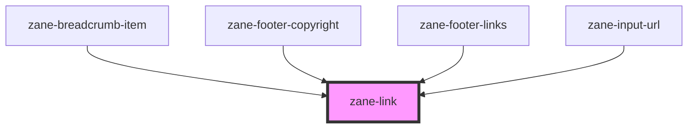

# zane-link

<!-- Auto Generated Below -->

## Overview

智能链接组件

## Properties

| Property | Attribute | Description  | Type     | Default     |
| -------- | --------- | ------------ | -------- | ----------- |
| `href`   | `href`    | 链接目标地址 | `string` | `undefined` |
| `target` | `target`  | 链接打开方式 | `string` | `undefined` |

## Methods

### `triggerClick() => Promise<void>`

触发链接点击

#### Returns

Type: `Promise<void>`

## Dependencies

### Used by

- [zane-breadcrumb-item](../breadcrumb/breadcrumb-item)
- [zane-footer-copyright](../application/footer/footer-copyright)
- [zane-footer-links](../application/footer/footer-links)
- [zane-input-url](../input-url)

### Graph

---

_Built with [StencilJS](https://stenciljs.com/)_
