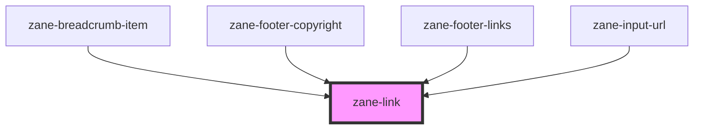

# zane-link

<!-- Auto Generated Below -->

## Properties

| Property | Attribute | Description | Type | Default |
| --- | --- | --- | --- | --- |
| `href` | `href` | Hyperlink to navigate to on click. | `string` | `undefined` |
| `target` | `target` | Sets or retrieves the window or frame at which to target content. | `string` | `undefined` |

## Methods

### `triggerClick() => Promise<void>`

#### Returns

Type: `Promise<void>`

## Dependencies

### Used by

- [zane-breadcrumb-item](../breadcrumb/breadcrumb-item)
- [zane-footer-copyright](../application/footer/footer-copyright)
- [zane-footer-links](../application/footer/footer-links)
- [zane-input-url](../input-url)

### Graph

---

_Built with [StencilJS](https://stenciljs.com/)_
