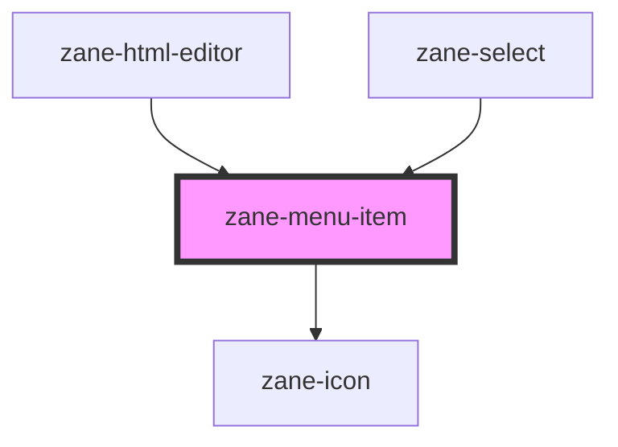

# zane-menu-item

<!-- Auto Generated Below -->

## Overview

菜单项组件 (zane-menu-item)

## Properties

| Property | Attribute | Description | Type | Default |
| --- | --- | --- | --- | --- |
| `color` | `color` | 菜单项色彩主题 | `"black" \| "danger" \| "default" \| "primary" \| "secondary" \| "success" \| "warning" \| "white"` | `'default'` |
| `disabled` | `disabled` | 禁用状态开关 | `boolean` | `false` |
| `href` | `href` | 链接目标地址 | `string` | `undefined` |
| `layer` | `layer` | 视觉层级 | `"01" \| "02" \| "background"` | `undefined` |
| `selectable` | `selectable` | 可选状态开关 | `boolean` | `false` |
| `selected` | `selected` | 选中状态 | `boolean` | `false` |
| `target` | `target` | 链接打开方式 | `string` | `'_self'` |
| `value` | `value` | 菜单项值 | `number \| string` | `undefined` |

## Events

| Event                   | Description    | Type               |
| ----------------------- | -------------- | ------------------ |
| `zane-menu-item--click` | 菜单项点击事件 | `CustomEvent<any>` |

## Methods

### `setBlur() => Promise<void>`

移除焦点方法

#### Returns

Type: `Promise<void>`

### `setFocus() => Promise<void>`

获取焦点方法

#### Returns

Type: `Promise<void>`

## Slots

| Slot    | Description                     |
| ------- | ------------------------------- |
|         | 主内容区域（必填）              |
| `"end"` | 右侧附加内容区域（如图标/徽章） |

## Dependencies

### Used by

- [zane-html-editor](../../html-editor)
- [zane-select](../../select)

### Depends on

- [zane-icon](../../icon)

### Graph

---

_Built with [StencilJS](https://stenciljs.com/)_
