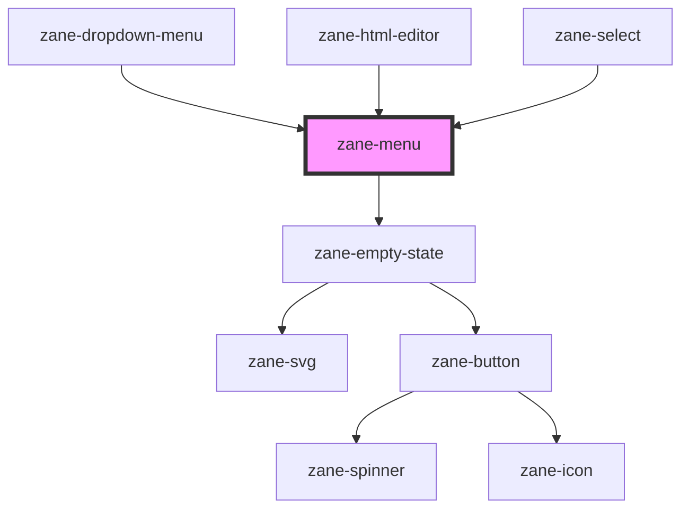

# zane-menu

<!-- Auto Generated Below -->

## Properties

| Property | Attribute | Description | Type | Default |
| --- | --- | --- | --- | --- |
| `empty` | `empty` |  | `boolean` | `false` |
| `emptyStateDescription` | `empty-state-description` |  | `string` | `'There are no items to display'` |
| `emptyStateHeadline` | `empty-state-headline` |  | `string` | `'No items'` |
| `layer` | `layer` |  | `"01" \| "02" \| "background"` | `undefined` |
| `showLoader` | `show-loader` |  | `boolean` | `false` |
| `size` | `size` | The menu item size. Possible values are: `"sm"`, `"md"`, `"lg"`. Defaults to `"md"`. | `"lg" \| "md" \| "sm"` | `'md'` |
| `value` | `value` |  | `number \| string` | `undefined` |

## Methods

### `setFocus() => Promise<void>`

Sets focus on first menu item. Use this method instead of the global `element.focus()`.

#### Returns

Type: `Promise<void>`

## CSS Custom Properties

| Name                     | Description                  |
| ------------------------ | ---------------------------- |
| `--zane-menu-background` | Background color of the menu |
| `--zane-menu-max-height` | Maximum height of the menu   |
| `--zane-menu-shadow`     | Shadow of the menu           |

## Dependencies

### Used by

- [zane-dropdown-menu](../../dropdown/dropdown-menu)
- [zane-html-editor](../../html-editor)
- [zane-select](../../select)

### Depends on

- [zane-empty-state](../../application/empty-state)

### Graph

---

_Built with [StencilJS](https://stenciljs.com/)_
