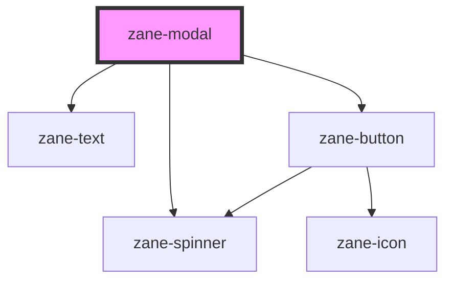

# zane-modal

<!-- Auto Generated Below -->

## Properties

| Property | Attribute | Description | Type | Default |
| --- | --- | --- | --- | --- |
| `heading` | `heading` |  | `string` | `undefined` |
| `hideClose` | `hide-close` |  | `boolean` | `false` |
| `managed` | `managed` | Specify whether the Modal is managed by the parent component | `boolean` | `false` |
| `open` | `open` | Specify whether the Modal is currently open | `boolean` | `false` |
| `showLoader` | `show-loader` |  | `boolean` | `false` |
| `size` | `size` |  | `"lg" \| "md" \| "sm"` | `'md'` |
| `subheading` | `subheading` |  | `string` | `undefined` |

## Events

| Event | Description | Type |
| --- | --- | --- |
| `zane-modal--close` | On click of button, a CustomEvent 'zane-modal--close' will be triggered. | `CustomEvent<any>` |

## Dependencies

### Depends on

- [zane-text](../../text)
- [zane-button](../../button/button)
- [zane-spinner](../../spinner)

### Graph

---

_Built with [StencilJS](https://stenciljs.com/)_
