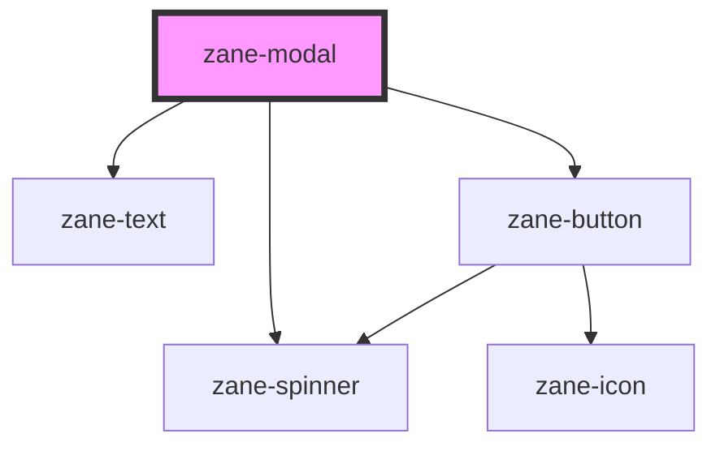

# zane-modal

<!-- Auto Generated Below -->

## Overview

模态框组件 (zane-modal)

## Properties

| Property | Attribute | Description | Type | Default |
| --- | --- | --- | --- | --- |
| `heading` | `heading` | 模态框主标题 | `string` | `undefined` |
| `hideClose` | `hide-close` | 隐藏关闭按钮 | `boolean` | `false` |
| `managed` | `managed` | 受控模式开关 | `boolean` | `false` |
| `open` | `open` | 模态框开启状态 | `boolean` | `false` |
| `showLoader` | `show-loader` | 加载状态显示 | `boolean` | `false` |
| `size` | `size` | 模态框尺寸方案 | `"lg" \| "md" \| "sm"` | `'md'` |
| `subheading` | `subheading` | 副标题文本 | `string` | `undefined` |

## Events

| Event               | Description    | Type               |
| ------------------- | -------------- | ------------------ |
| `zane-modal--close` | 模态框关闭事件 | `CustomEvent<any>` |

## Dependencies

### Depends on

- [zane-text](../../text)
- [zane-button](../../button/button)
- [zane-spinner](../../spinner)

### Graph

---

_Built with [StencilJS](https://stenciljs.com/)_
