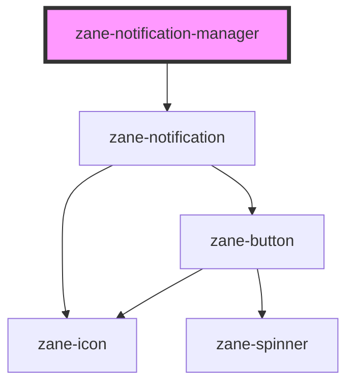

# zane-notification-manager

<!-- Auto Generated Below -->

## Properties

| Property | Attribute | Description | Type | Default |
| --- | --- | --- | --- | --- |
| `name` | `name` |  | `string` | `'global'` |
| `position` | `position` |  | `"bottom-left" \| "bottom-right" \| "top-left" \| "top-right"` | `'bottom-right'` |

## Dependencies

### Depends on

- [zane-notification](../notification)

### Graph

---

_Built with [StencilJS](https://stenciljs.com/)_
