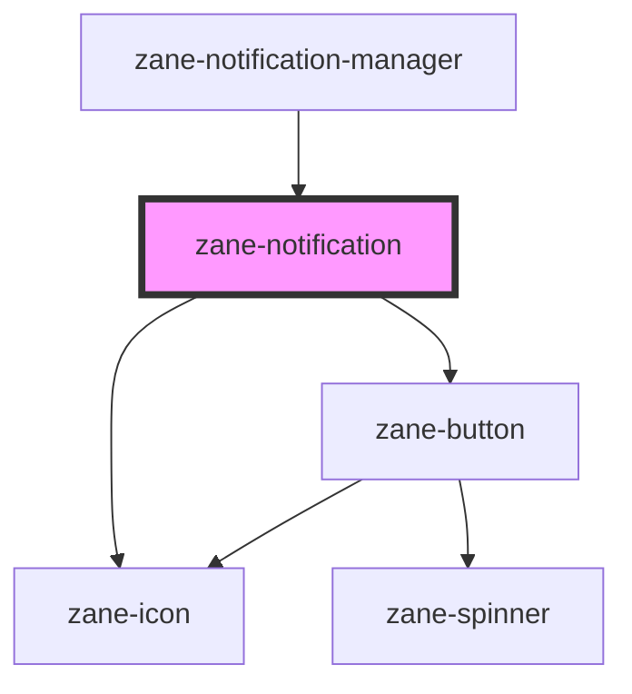

# zane-notification

<!-- Auto Generated Below -->

## Properties

| Property | Attribute | Description | Type | Default |
| --- | --- | --- | --- | --- |
| `action` | `action` | Action to be displayed on the notification | `string` | `undefined` |
| `dismissible` | `dismissible` | Whether the notification is dismissible | `boolean` | `false` |
| `highContrast` | `high-contrast` | Whether to use high contrast mode | `boolean` | `false` |
| `inline` | `inline` | Whether the notification should be displayed inline | `boolean` | `false` |
| `managed` | `managed` | Whether the notification is managed by the notification manager | `boolean` | `false` |
| `state` | `state` | The state of the notification. Possible values are: 'success', 'error', 'info', 'warning' | `"error" \| "info" \| "success" \| "warning"` | `'info'` |

## Events

| Event | Description | Type |
| --- | --- | --- |
| `zane-notification--action-click` |  | `CustomEvent<any>` |
| `zane-notification--dismiss` | Emitted when the notification is dismissed | `CustomEvent<any>` |

## Dependencies

### Used by

- [zane-notification-manager](../notification-manager)

### Depends on

- [zane-icon](../icon)
- [zane-button](../button/button)

### Graph

---

_Built with [StencilJS](https://stenciljs.com/)_
