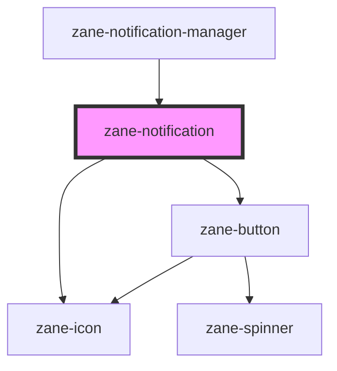

# zane-notification

<!-- Auto Generated Below -->

## Overview

智能通知系统组件 (zane-notification)

## Properties

| Property | Attribute | Description | Type | Default |
| --- | --- | --- | --- | --- |
| `action` | `action` | 操作按钮文本 | `string` | `undefined` |
| `dismissible` | `dismissible` | 可关闭特性 | `boolean` | `false` |
| `highContrast` | `high-contrast` | 高对比度模式 | `boolean` | `false` |
| `inline` | `inline` | 内联布局模式 | `boolean` | `false` |
| `managed` | `managed` | 托管关闭模式 | `boolean` | `false` |
| `state` | `state` | 通知状态类型 | `"error" \| "info" \| "success" \| "warning"` | `'info'` |

## Events

| Event                             | Description      | Type               |
| --------------------------------- | ---------------- | ------------------ |
| `zane-notification--action-click` | 操作按钮点击事件 | `CustomEvent<any>` |
| `zane-notification--dismiss`      | 通知关闭事件     | `CustomEvent<any>` |

## Dependencies

### Used by

- [zane-notification-manager](../notification-manager)

### Depends on

- [zane-icon](../icon)
- [zane-button](../button/button)

### Graph

---

_Built with [StencilJS](https://stenciljs.com/)_
