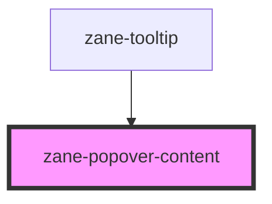

# zane-popover-content

<!-- Auto Generated Below -->

## CSS Custom Properties

| Name                              | Description                             |
| --------------------------------- | --------------------------------------- |
| `--popover-content-background`    | Background color of the popover content |
| `--popover-content-border-radius` | Border radius of the popover content    |
| `--popover-padding`               | Padding of the popover content          |
| `--zane-menu-shadow`              | Shadow of popover content               |

## Dependencies

### Used by

- [zane-tooltip](../../tooltip)

### Graph

---

_Built with [StencilJS](https://stenciljs.com/)_
