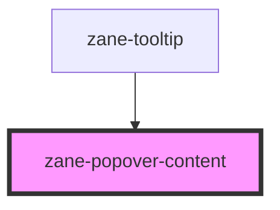

# zane-popover-content

<!-- Auto Generated Below -->

## Overview

弹出框内容容器组件 (zane-popover-content)

## Slots

| Slot | Description                                              |
| ---- | -------------------------------------------------------- |
|      | 默认插槽用于承载弹出内容（文本/图片/表单等任意HTML内容） |

## CSS Custom Properties

| Name                              | Description                             |
| --------------------------------- | --------------------------------------- |
| `--popover-content-background`    | Background color of the popover content |
| `--popover-content-border-radius` | Border radius of the popover content    |
| `--popover-padding`               | Padding of the popover content          |
| `--zane-menu-shadow`              | Shadow of popover content               |

## Dependencies

### Used by

- [zane-tooltip](../../tooltip)

### Graph

---

_Built with [StencilJS](https://stenciljs.com/)_
