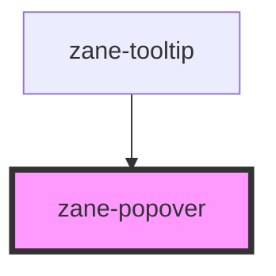

# zane-popover

<!-- Auto Generated Below -->

## Overview

弹出框组件（Popover）

## Properties

| Property | Attribute | Description | Type | Default |
| --- | --- | --- | --- | --- |
| `dismissTimeout` | `dismiss-timeout` | 弹出框关闭的动画时间（毫秒） | `number` | `300` |
| `offset` | `offset` | 弹出框与目标元素之间的偏移量（像素） | `number` | `4` |
| `open` | `open` | 控制弹出框的打开状态 | `boolean` | `false` |
| `openTimeout` | `open-timeout` | 弹出框打开的动画时间（毫秒） | `number` | `200` |
| `placements` | `placements` | 弹出框的位置偏好设置，使用逗号分隔的字符串，例如："top,bottom" 当 `tip` 属性为 'tab' 时，默认设置为 'bottom-end,bottom-start,top-end,top-start' | `string` | `undefined` |
| `tip` | `tip` | 弹出框的箭头样式 | `"caret" \| "none" \| "tab"` | `'caret'` |
| `trigger` | `trigger` | 触发弹出框的方式 | `"click" \| "hover" \| "manual"` | `'hover'` |

## Events

| Event                 | Description              | Type               |
| --------------------- | ------------------------ | ------------------ |
| `zane-popover--close` | 当弹出框关闭时发出的事件 | `CustomEvent<any>` |
| `zane-popover--open`  | 当弹出框打开时发出的事件 | `CustomEvent<any>` |

## Methods

### `hide() => Promise<void>`

隐藏弹出框的公共方法

#### Returns

Type: `Promise<void>`

### `show(target?: HTMLElement) => Promise<void>`

显示弹出框的公共方法

#### Parameters

| Name | Type | Description |
| --- | --- | --- |
| `target` | `HTMLElement` | - 可选的触发元素。如果提供，将使用此元素作为触发元素。 |

#### Returns

Type: `Promise<void>`

## Dependencies

### Used by

- [zane-tooltip](../../tooltip)

### Graph

---

_Built with [StencilJS](https://stenciljs.com/)_
