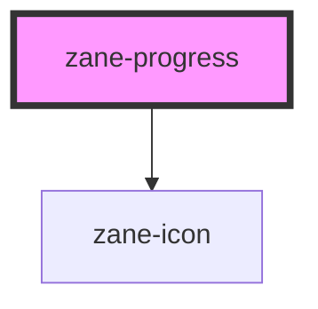

# zane-progress

<!-- Auto Generated Below -->

## Overview

动态进度指示器组件 (zane-progress)

## Properties

| Property | Attribute | Description | Type | Default |
| --- | --- | --- | --- | --- |
| `helperText` | `helper-text` | 辅助说明文本 | `string` | `undefined` |
| `hideLabel` | `hide-label` | 是否隐藏标签区域 | `boolean` | `false` |
| `label` | `label` | 进度标签文本 | `string` | `undefined` |
| `size` | `size` | 组件尺寸模式 | `"md" \| "sm"` | `'md'` |
| `status` | `status` | 进度状态类型 | `"active" \| "error" \| "success"` | `'active'` |
| `value` | `value` | 当前进度值 | `number` | `null` |

## Slots

| Slot | Description              |
| ---- | ------------------------ |
|      | 无插槽设计（纯视觉组件） |

## Dependencies

### Depends on

- [zane-icon](../icon)

### Graph

---

_Built with [StencilJS](https://stenciljs.com/)_
