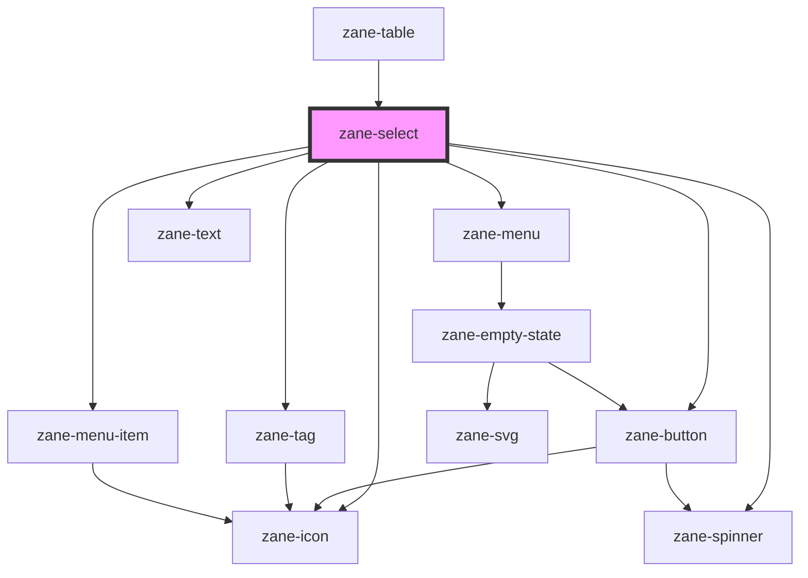

# zane-select

<!-- Auto Generated Below -->

## Properties

| Property | Attribute | Description | Type | Default |
| --- | --- | --- | --- | --- |
| `clearable` | `clearable` | If `true`, a clear icon will appear in the input when there is a value. Clicking it clears the input. | `boolean` | `false` |
| `configAria` | `config-aria` |  | `any` | `{}` |
| `debounce` | `debounce` | Set the amount of time, in milliseconds, to wait to trigger the `zaneChange` event after each keystroke. | `number` | `300` |
| `disabled` | `disabled` | If true, the user cannot interact with the button. Defaults to `false`. | `boolean` | `false` |
| `helperText` | `helper-text` |  | `string` | `undefined` |
| `hideDropdownIcon` | `hide-dropdown-icon` |  | `boolean` | `false` |
| `inline` | `inline` |  | `boolean` | `false` |
| `invalid` | `invalid` |  | `boolean` | `false` |
| `invalidText` | `invalid-text` |  | `string` | `undefined` |
| `items` | `items` | [{ label: 'Zane Deng', value: 'zane-deng', icon: 'person' }] | `{ icon?: string; label: string \| number; value: string \| number; }[]` | `[]` |
| `label` | `label` |  | `string` | `undefined` |
| `layer` | `layer` |  | `"01" \| "02" \| "background"` | `undefined` |
| `multiple` | `multiple` |  | `boolean` | `false` |
| `name` | `name` | The input field name. | `string` | `` `zane-input-${this.gid}` `` |
| `open` | `open` |  | `boolean` | `false` |
| `placeholder` | `placeholder` | The input field placeholder. | `string` | `undefined` |
| `placements` | `placements` |  | `string` | `'bottom-start,top-start,bottom-end,top-end'` |
| `readonly` | `readonly` | If true, the user cannot interact with the button. Defaults to `false`. | `boolean` | `false` |
| `required` | `required` | If true, required icon is show. Defaults to `false`. | `boolean` | `false` |
| `search` | `search` | Search type Possible values are `"none"`, `"initial"`, `"contains"`, `"managed"`. Defaults to `"none"`. | `"contains" \| "initial" \| "managed" \| "none"` | `'none'` |
| `showLoader` | `show-loader` |  | `boolean` | `false` |
| `size` | `size` | The select input size. Possible values are: `"sm"`, `"md"`, `"lg"`. Defaults to `"md"`. | `"lg" \| "md" \| "sm"` | `'md'` |
| `state` | `state` | The input state. Possible values are: `"success"`, `"error"`, `"warning"`, 'default'. Defaults to `"default"`. | `"default" \| "error" \| "success" \| "warning"` | `'default'` |
| `value` | `value` | The input field value. | `number \| string` | `''` |
| `warn` | `warn` |  | `boolean` | `false` |
| `warnText` | `warn-text` |  | `string` | `undefined` |

## Events

| Event | Description | Type |
| --- | --- | --- |
| `zane-select--change` | Emitted when the value has changed. | `CustomEvent<any>` |
| `zane-select--enter` |  | `CustomEvent<any>` |
| `zane-select--search` | Emitted when a keyboard input occurred. | `CustomEvent<any>` |

## Methods

### `getComponentId() => Promise<string>`

#### Returns

Type: `Promise<string>`

### `openSelectList() => Promise<void>`

#### Returns

Type: `Promise<void>`

### `setBlur() => Promise<void>`

Sets blur on the native `input` in `zane-input`. Use this method instead of the global `input.blur()`.

#### Returns

Type: `Promise<void>`

### `setFocus() => Promise<void>`

Sets focus on the native `input` in `ion-input`. Use this method instead of the global `input.focus()`.t

#### Returns

Type: `Promise<void>`

## Dependencies

### Used by

- [zane-table](../table)

### Depends on

- [zane-button](../button/button)
- [zane-tag](../tag)
- [zane-icon](../icon)
- [zane-spinner](../spinner)
- [zane-menu](../menu/menu)
- [zane-text](../text)
- [zane-menu-item](../menu/menu-item)

### Graph

---

_Built with [StencilJS](https://stenciljs.com/)_
