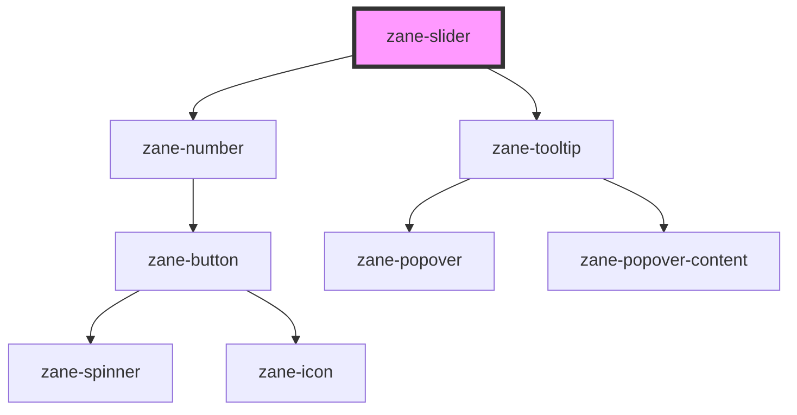

# zane-slider

<!-- Auto Generated Below -->

## Overview

滑动选择器组件

提供可拖动的滑块选择器，支持鼠标/触摸交互、键盘操作和数值输入框集成。

## Properties

| Property | Attribute | Description | Type | Default |
| --- | --- | --- | --- | --- |
| `configAria` | `config-aria` | ARIA 属性配置对象 | `any` | `{}` |
| `debounce` | `debounce` | 值变更事件的防抖时间（毫秒） | `number` | `300` |
| `disabled` | `disabled` | 禁用状态开关 | `boolean` | `false` |
| `formatter` | `formatter` | 数值格式化函数 | `(value: string \| number) => string` | `undefined` |
| `max` | `max` | 滑块最大值 | `number` | `100` |
| `min` | `min` | 滑块最小值 | `number` | `0` |
| `name` | `name` | 表单字段名称 | `string` | `` `zane-input-${this.gid}` `` |
| `readonly` | `readonly` | 只读状态开关 | `boolean` | `false` |
| `required` | `required` | 必填状态 | `boolean` | `false` |
| `showOnlySlider` | `show-only-slider` | 是否仅显示滑块（隐藏数值输入框） | `boolean` | `false` |
| `step` | `step` | 步进值 | `number` | `1` |
| `value` | `value` | 当前滑块值 | `number` | `0` |

## Events

| Event                 | Description          | Type               |
| --------------------- | -------------------- | ------------------ |
| `zane-slider--change` | 值变更事件（带防抖） | `CustomEvent<any>` |
| `zane-slider--input`  | 输入实时事件         | `CustomEvent<any>` |

## Methods

### `getComponentId() => Promise<string>`

获取组件唯一ID

#### Returns

Type: `Promise<string>`

组件唯一标识符

### `setBlur() => Promise<void>`

移除组件焦点

#### Returns

Type: `Promise<void>`

### `setFocus() => Promise<void>`

设置组件焦点

#### Returns

Type: `Promise<void>`

## Dependencies

### Depends on

- [zane-number](../input-number)
- [zane-tooltip](../tooltip)

### Graph

---

_Built with [StencilJS](https://stenciljs.com/)_
