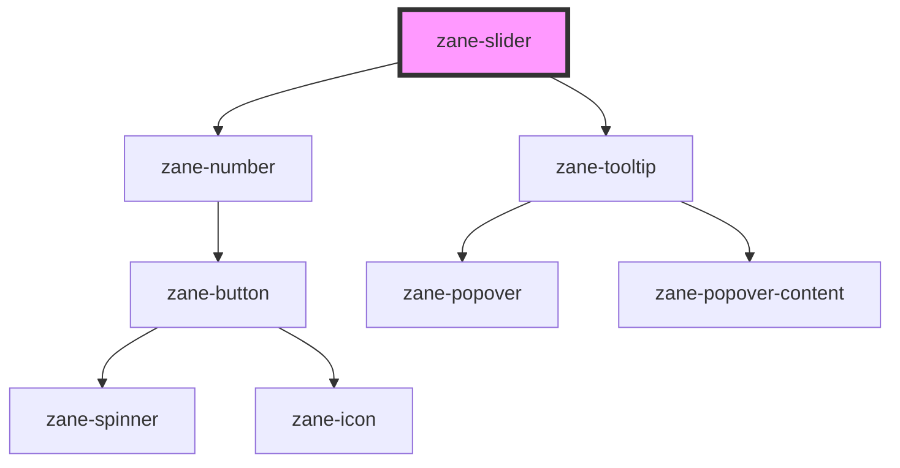

# zane-slider

<!-- Auto Generated Below -->

## Properties

| Property | Attribute | Description | Type | Default |
| --- | --- | --- | --- | --- |
| `configAria` | `config-aria` |  | `any` | `{}` |
| `debounce` | `debounce` | Set the amount of time, in milliseconds, to wait to trigger the `zaneChange` event after each keystroke. | `number` | `300` |
| `disabled` | `disabled` | If true, the user cannot interact with the button. Defaults to `false`. | `boolean` | `false` |
| `formatter` | `formatter` | function to format the value of the input | `(value: string \| number) => string` | `undefined` |
| `max` | `max` |  | `number` | `100` |
| `min` | `min` |  | `number` | `0` |
| `name` | `name` | The input field name. | `string` | `` `zane-input-${this.gid}` `` |
| `readonly` | `readonly` | If true, the user cannot interact with the button. Defaults to `false`. | `boolean` | `false` |
| `required` | `required` | If true, required icon is show. Defaults to `false`. | `boolean` | `false` |
| `showOnlySlider` | `show-only-slider` |  | `boolean` | `false` |
| `step` | `step` |  | `number` | `1` |
| `value` | `value` | The input field value. | `number` | `0` |

## Events

| Event | Description | Type |
| --- | --- | --- |
| `zane-slider--change` | Emitted when the value has changed. | `CustomEvent<any>` |
| `zane-slider--input` | Emitted when a keyboard input occurred. | `CustomEvent<any>` |

## Methods

### `getComponentId() => Promise<string>`

#### Returns

Type: `Promise<string>`

### `setBlur() => Promise<void>`

Sets blur on the native `input` in `zane-input`. Use this method instead of the global `input.blur()`.

#### Returns

Type: `Promise<void>`

### `setFocus() => Promise<void>`

Sets focus on the native `input` in `ion-input`. Use this method instead of the global `input.focus()`.

#### Returns

Type: `Promise<void>`

## Dependencies

### Depends on

- [zane-number](../input-number)
- [zane-tooltip](../tooltip)

### Graph

---

_Built with [StencilJS](https://stenciljs.com/)_
