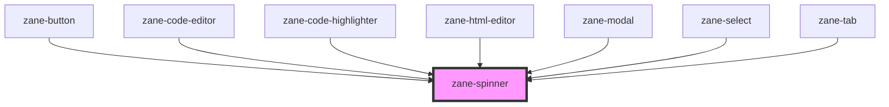

# zane-spinner

<!-- Auto Generated Below -->

## Properties

| Property | Attribute | Description | Type | Default |
| --- | --- | --- | --- | --- |
| `description` | `description` |  | `string` | `'Loading...'` |
| `hideBackground` | `hide-background` |  | `boolean` | `false` |
| `size` | `size` | The Icon size. Possible values are: `"sm"`, `"md"`, `"lg"` and size in pixel. Defaults to `"md"`. | `string` | `'md'` |

## Dependencies

### Used by

- [zane-button](../button/button)
- [zane-code-editor](../code-editor)
- [zane-code-highlighter](../code-highlighter)
- [zane-html-editor](../html-editor)
- [zane-modal](../modal/modal)
- [zane-select](../select)
- [zane-tab](../tabs/tab)

### Graph

---

_Built with [StencilJS](https://stenciljs.com/)_
