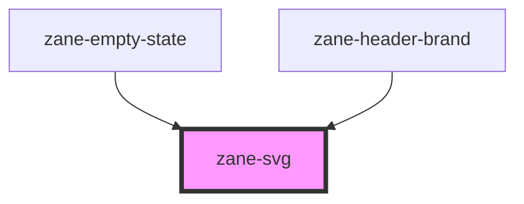

# zane-svg

<!-- Auto Generated Below -->

## Overview

SVG 动态加载组件 (zane-svg)

## Properties

| Property | Attribute | Description  | Type     | Default     |
| -------- | --------- | ------------ | -------- | ----------- |
| `size`   | `size`    | 图标尺寸配置 | `string` | `undefined` |
| `src`    | `src`     | SVG 资源路径 | `string` | `''`        |

## Dependencies

### Used by

- [zane-empty-state](../application/empty-state)
- [zane-header-brand](../application/header/header-brand)

### Graph

---

_Built with [StencilJS](https://stenciljs.com/)_
