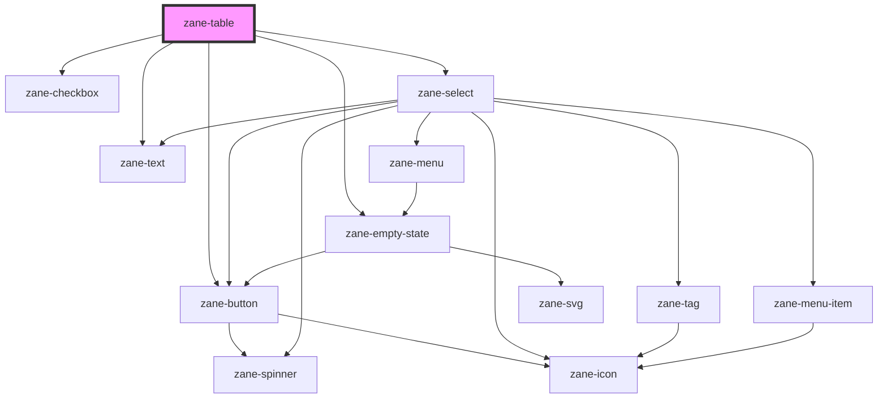

# zane-table

<!-- Auto Generated Below -->

## Properties

| Property | Attribute | Description | Type | Default |
| --- | --- | --- | --- | --- |
| `columns` | `columns` | 表格列配置数组 | `any[]` | `[]` |
| `data` | `data` | 表格数据源 | `any[]` | `[]` |
| `emptyStateDescription` | `empty-state-description` | 空状态描述文本 | `string` | `'There are no items to display'` |
| `emptyStateHeadline` | `empty-state-headline` | 空状态标题文本 | `string` | `'No items'` |
| `keyField` | `key-field` | 行数据唯一标识字段名 | `string` | `'id'` |
| `layer` | `layer` | 组件视觉层级（影响阴影和z-index） | `"01" \| "02" \| "background"` | `undefined` |
| `managed` | `managed` | 是否为托管模式（外部控制分页/排序） | `boolean` | `false` |
| `page` | `page` | 当前页码 | `number` | `1` |
| `pageSize` | `page-size` | 每页显示条数 | `number` | `10` |
| `paginate` | `paginate` | 是否启用分页 | `boolean` | `true` |
| `selectedRowKeys` | `selected-row-keys` | 已选中的行key数组 | `string[]` | `[]` |
| `selectionType` | `selection-type` | 行选择类型 | `"checkbox"` | `undefined` |
| `sortBy` | `sort-by` | 当前排序字段 | `string` | `undefined` |
| `sortOrder` | `sort-order` | 排序方向 | `"asc" \| "desc"` | `'asc'` |
| `sortable` | `sortable` | 是否启用排序 | `boolean` | `true` |
| `totalItems` | `total-items` | 数据总条数（托管模式下必传） | `any` | `undefined` |

## Events

| Event                          | Description    | Type               |
| ------------------------------ | -------------- | ------------------ |
| `zane-table--cell-click`       | 单元格点击事件 | `CustomEvent<any>` |
| `zane-table--page`             | 分页变更事件   | `CustomEvent<any>` |
| `zane-table--selection-change` | 选择变更事件   | `CustomEvent<any>` |
| `zane-table--sort`             | 排序事件       | `CustomEvent<any>` |

## Dependencies

### Depends on

- [zane-checkbox](../checkbox)
- [zane-button](../button/button)
- [zane-select](../select)
- [zane-text](../text)
- [zane-empty-state](../application/empty-state)

### Graph

---

_Built with [StencilJS](https://stenciljs.com/)_
