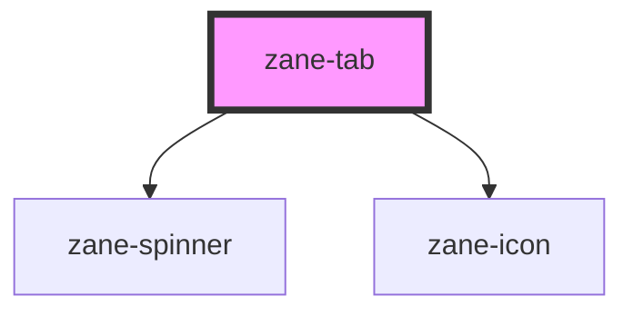

# zane-tab

<!-- Auto Generated Below -->

## Overview

单个标签页元素，支持多种交互状态和类型

## Properties

| Property | Attribute | Description | Type | Default |
| --- | --- | --- | --- | --- |
| `disabled` | `disabled` | 是否禁用标签 | `boolean` | `false` |
| `disabledReason` | `disabled-reason` | 禁用状态提示信息（支持无障碍访问） | `string` | `''` |
| `href` | `href` | 链接地址（存在时渲染为<a>标签） | `string` | `undefined` |
| `icon` | `icon` | 图标名称（内置图标库） | `string` | `undefined` |
| `label` | `label` | 标签文本（备用显示内容） | `string` | `undefined` |
| `selected` | `selected` | 选中状态（与父级Tabs组件联动） | `boolean` | `false` |
| `showLoader` | `show-loader` | 显示加载指示器 | `boolean` | `false` |
| `target` | `target` | 关联面板标识 | `string` | `undefined` |
| `type` | `type` | 标签类型（需与父级Tabs组件同步） | `"contained" \| "contained-bottom" \| "default"` | `'default'` |
| `value` | `value` | 标签值（用于表单场景） | `string` | `undefined` |

## Events

| Event             | Description                    | Type               |
| ----------------- | ------------------------------ | ------------------ |
| `zane-tab--click` | 标签点击事件（冒泡给父级Tabs） | `CustomEvent<any>` |

## Methods

### `setFocus() => Promise<void>`

设置焦点（公共方法）

#### Returns

Type: `Promise<void>`

### `triggerClick() => Promise<void>`

触发点击（公共方法）

#### Returns

Type: `Promise<void>`

## Dependencies

### Depends on

- [zane-spinner](../../spinner)
- [zane-icon](../../icon)

### Graph

---

_Built with [StencilJS](https://stenciljs.com/)_
